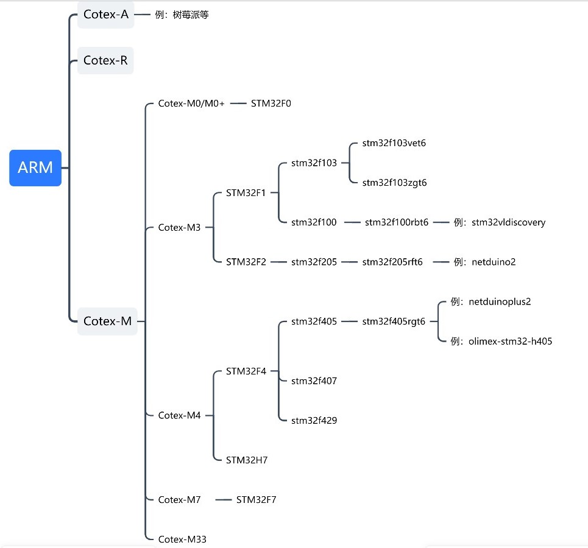
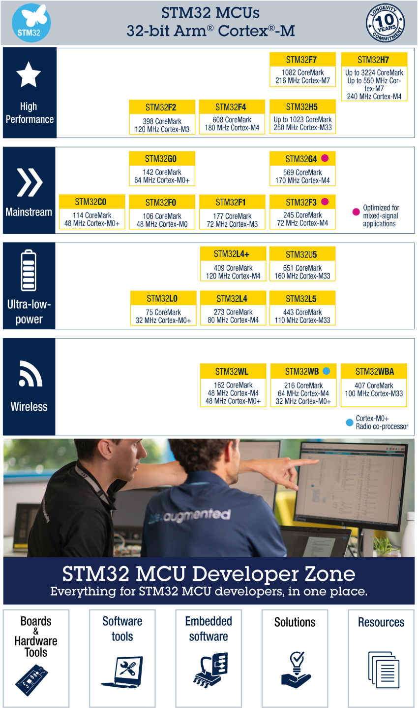

## STM32

##### 什么是STM32

STM32是一类典型的ARM架构的机器。它属于ARM架构中__A__（高性能，用于迷你PC、手机等）、__R__（实时性）、__M__(微控制器)中的M类（即Cotex-M系列）。Cotex-M系列的机器属于ARM处理器中32位的微控制器（单片机），一般用于嵌入式开发中。Cotex-M又可以继续细分为如下图更多类型的机器，这里只列举了一些典型的STM32的分支，其他厂家的机器没有列举，树状图并不完整，但已经非常庞大，可见ARM架构的机器类型是多么的丰富。其中末端的“例”中的机器是QEMU所支持模拟的。



对此，STM32官方也公布了一张图展示STM32机器对应的ARM架构，并从功能方面分成了高性能、主流、低功耗和无线4大类。



##### STM32与操作系统

实际上单片机（MCU）一般性能很差，只执行一些非常简单的控制功能，不应该运行OS，但STM32这系列单片机可以运行部分简单的操作系统（比如各种RTOS），可见这系列MCU性能很强，已经不是一般的MCU了。

当STM32单片机需要执行的任务比较简单时，一般都会直接烧录裸机程序，即这台机器没有操作系统，不能完成任务调度的功能，只能一个任务从头走到尾，此时一般都会利用while(1)循环执行一系列代码，配合中断可以完成大部分基础任务。但是当任务比较复杂时，只写裸机运行的程序不仅会增加代码的复杂度，加长开发时间，而且程序执行的效率也会比较低，此时可以使用简单的操作系统，比如FreeRTOS。但此时操作系统内核代码一般和用户程序一起编译，相互无法完全分离，某种意义上，这个操作系统更像是一个特殊的用户程序，用于管理其他用户程序，利用中断等机制切换不同的任务。

##### STM32与QEMU

由于ARM架构的机器实在是太多了，STM32又只是使用这个架构的机器中的一个系列，因此QEMU难以支持所有的STM32机器。如上面树状图所示netduino2、netduinoplus2、stm32vldiscovery这三款典型的STM32的机器被QEMU所支持，但是还有更多更多的STM32机器目前还不被QEMU所支持。

如果我们想用QEMU启动一款STM32机器，可参考下面例子的命令

```bash
$ qemu-system-arm -M stm32vldiscovery -kernel firmware.bin 
# -M指定一个机器，-kernel指定机器上要运行源的代码编译出来的bin文件（二进制文件）
```

##### STM32与MMU

MMU即内存管理单元，许多操作系统需要MMU才可以运行，比如Linux等，如果一个机器没有MMU，那么它就不能运行Linux，但是可以运行vxWorks、uLinux、FreeRTOS等更简单的OS。而STM32这系列的机器是面向嵌入式领域的MCU，芯片中并没有MMU，因此无法运行使用了MMU的操作系统，从而如果我们本次的项目想要给FreeRTOS增加MMU相应的功能的话，就不能用STM32进行测试。


##### 参考资料

[STM32 Microcontrollers](https://www.st.com/en/microcontrollers-microprocessors/stm32-32-bit-arm-cortex-mcus.html)

[STMicroelectronics STM32 boards (netduino2, netduinoplus2, stm32vldiscovery)](https://www.qemu.org/docs/master/system/arm/stm32.html)