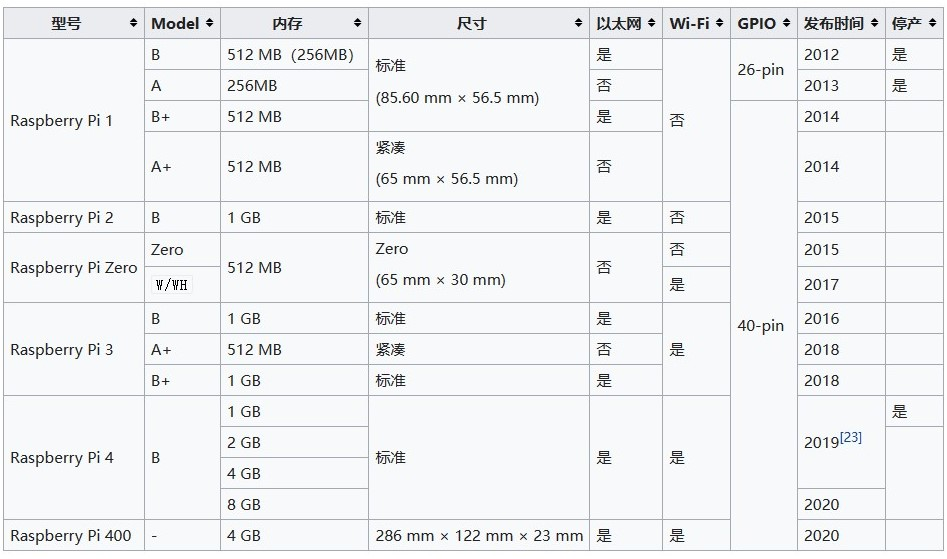

## Raspberry Pi

##### 什么是树莓派

树莓派是一款ARM架构的64位机器。它属于Cotex-A架构，因此具有很高的性能，具有MMU，可以运行linux等操作系统。

虽然树莓派就是一块很小的板子，但是其性能的优越使其可以当作一个迷你的个人PC用，许多PC上的接口比如USB、以太网、HDMI都能在树莓派上找到。树莓派可以做到大部分PC能做到的使其，比如将其当作一台服务器或者配合键鼠当作迷你笔记本电脑用；当然对于一些更简单的单片机都能完成的任务也可以用它来完成，树莓派同样提供一些MCU上常见的GPIO。

前些年由于树莓派的价格十分亲民，只需要几百元就能买到一台迷你的电脑，因此许多人买来做一些应用开发和学习，构建了其强大的生态环境。但是近年来官方似乎放弃了其低价高性能的定位，价格越来越高，因此许多人正在积极寻找替代品，比如国产的orange pi。

目前树莓派已有多种型号，他们

##### 树莓派和QEMU

##### 参考资料

[What Is a Raspberry Pi? Here's What You Need to Know](https://www.makeuseof.com/what-is-raspberry-pi/)

[raspbian - How to emulate Raspberry Pi in QEMU?](https://raspberrypi.stackexchange.com/questions/117234/how-to-emulate-raspberry-pi-in-qemu)

[树莓派 wiki](https://zh.wikipedia.org/wiki/树莓派)

