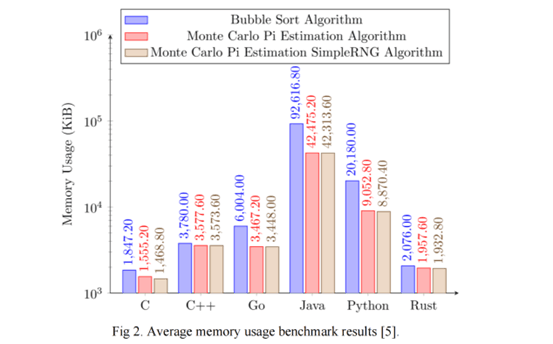
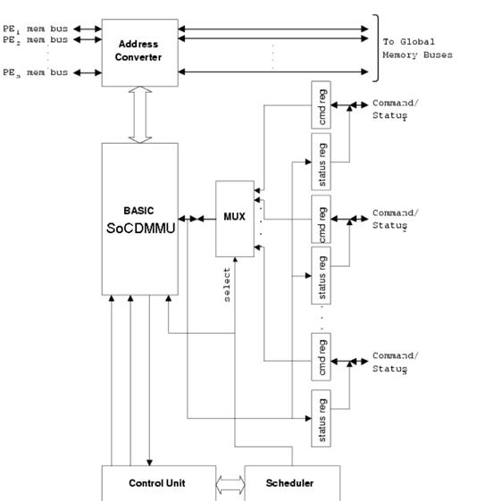
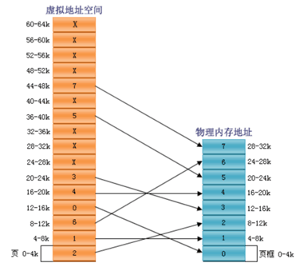
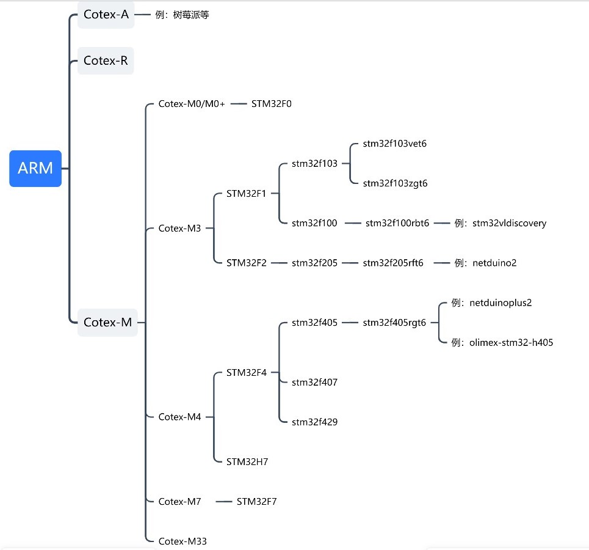
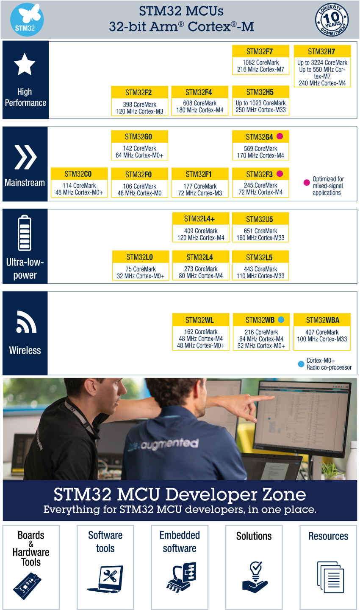
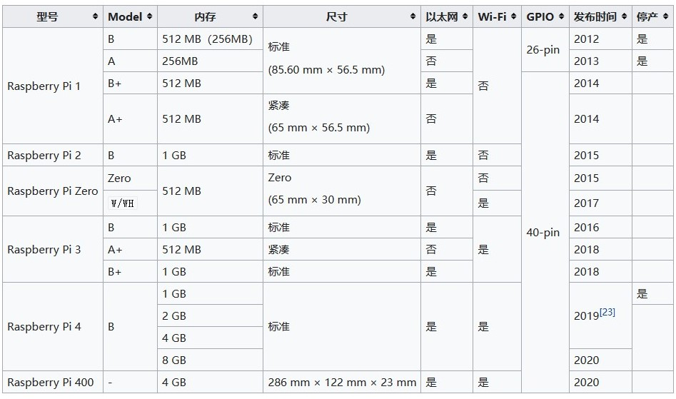

# FreeRTOS可行性报告

[一、项目介绍](##一、项目介绍)

[二、理论依据](##二、理论依据)

[1. Rust语言安全性](###1. Rust语言安全性)

[2. MMU虚拟内存管理](###2. MMU虚拟内存管理)

[三、技术依据](##三、技术依据)

[1. Rust 重写 FreeRTOS](###1. Rust 重写 FreeRTOS)

[2. 软硬件平台介绍](###2. 软硬件平台介绍)

[四、创新点](##四、创新点)

[五、概要设计](##五、概要设计)

[1. 最终目标](###1. 最终目标)

[2. 测试验证](###2. 测试验证)

[3. 项目分工](###3. 项目分工)

## 一、项目介绍

我们选择的课题是使用 Rust 语言重写FreeRTOS，并在FreeRTOS增加对MMU的支持。我们将完全使用 Rust 这种安全性极高的语言来编写代码。

FreeRTOS是现在主流的嵌入式操作系统，它是一个轻量级的操作系统，功能包括：任务管理、时间管理、信号量、消息队列、内存管理、记录功能、软件定时器、协程等，可基本满足较小系统的需要。但FreeRTOS仍存在很多安全问题，对这些安全问题，C语言因其本身的缺陷难辞其咎。而用 Rust 编写 FreeRTOS，能够在维持FreeRTOS高性能的同时，最大限度的保证其安全性。

同时FreeRTOS在功能上并不完善，不支持使用MMU，我们将弥补FreeRTOS的这一缺陷，在FreeRTOS中加入对MMU的使用。

## 二、理论依据

### 1. Rust语言安全性

#### (1). Rust 简介

Rust最初是由[Mozilla](https://baike.baidu.com/item/Mozilla/7148071?fromModule=lemma_inlink)研究院的Graydon Hoare设计创造，然后在Dave Herman, Brendan Eich以及很多其他人的贡献下逐步完善的。 Rust的设计者们通过在研发Servo网站浏览器布局引擎过程中积累的经验优化了Rust语言和Rust[编译器](https://baike.baidu.com/item/编译器/8853067?fromModule=lemma_inlink)。

从发布起，Rust受到了广泛的关注，连续七年在 Stack Overflow开发者调查的“最受喜爱编程语言”评选项目中折取桂冠。开发者对于Rust语言的关注度也在逐步提升（如下图）


#### (2). Rust相关概念

- **所有权**：相比C/C++这样手动管理内存的语言，和JAVA这种在自动回收内存资源的同时降低运行效率的语言，Rust通过所有权可以在编译阶段就能有效分析内存资源有效性，在牺牲较少性能的情况下提升管理效率。

- **所有权规则**：

  - Rust 中的每个值都有一个变量，称为其所有者；

  - 一次只能有一个所有者；

  - 当所有者不在程序运行范围时，该值将被删除;

对于基本数据类型(int、struct等)的栈内存，超出作用域后的自动释放和其他语言差别不大；

但对于Rust中非基本数据类型的数据(String等)，交互发生在堆中，Rust对堆内存一视同仁，也会在超出作用域后自动释放。

如`let s1 = String::from("hello");` 此时有以下几种保护内存的方式：

- 某段内存只能被最后的变量名所有，前面声明过的变量都作废，以`let s2 = s1;` 为例，该语句之后s1失效，所有权转交给s2，可以防止多次释放。

- **租借(borrowing)**: `let s2 = &s1;`

  通过引用的方式s2租借了值的所有权，在s1所有权改变时s2将无法继续租借；除非同时s1可变且s2为可变引用，否则s2只有使用权，而无法修改。

- 可变引用不允许多重引用，防止了并发状态下数据访问碰撞。

- 编译器会发现悬垂引用并进行报错。

#### (3). Rust优势

**能够保证安全性**

Rust是一种系统级编程语言，与其他语言相比，在安全方面有以下优越性：

- 内存安全性：Rust通过使用所有权（ownership）、租借（borrowing）和生命周期（lifetime）的概念来管理内存。这些概念确保了在编译时就避免了常见的内存错误，例如空指针、野指针、缓冲区溢出和数据竞争等。

- 防止空指针引用：在Rust中，空指针是不存在的，因为所有指针都必须指向有效的内存地址。这使得rust程序更加健壮，减少了由于空指针引用而导致的崩溃问题。

- 数据竞争检测：Rust在编译时执行数据竞争检测，确保多个线程或并发任务之间的共享数据访问不会导致不可预期的行为，可以避免许多常见的内存错误和多线程问题。

- 防止缓冲区溢出：Rust的标准库提供了一系列安全的API，可以帮助开发人员编写更加安全的代码，包括字符串处理和文件I/O等功能。

**不限制性能的同时简化了语言**

- Rust使用零损耗抽象的概念，在不限制性能的同时简化了语言。例如：

  A. 单形态化：允许用户创建通用化的函数，并在编译时转化为具体类型的函数。

  B. 标准库函数：不需要重新创建通用类型，提供了性能和互用性更好的库。

- Rust没有内存垃圾收集器。垃圾收集器：

  A. 垃圾收集器增加了内存和cpu的使用。

  B. 垃圾处理器很难控制，可能会导致意外的暂停。

**适合编写高性能的程序**

Rust 能够在损失较少性能的情况下提供高度的安全性， 具有与 C 和 C++ 相当的性能，可以编写高性能的系统级代码。Rust 的内存管理机制使其比其他语言更适合编写高性能的并发程序。

下图反映了六种语言的性能：

 


 



**其它优点**

- 隔离（isolation）零拷贝的软件故障隔离：

  Rust支持软件故障隔离（SFI）比任何主流语言都要低的开销。SFI封装

  软件中不受信任的扩展，且不依赖于硬件地址空间。

- 分析（analysis）有效的静态信息流分析

  Rust实现精确高效的静态信息流量控制（IFC）。IFC确保不受信任的模块不会通过未经授权的渠道泄露敏感数据,从而为其提供安全保障。

- 自动化（automation）自动检查点

#### (4). 总结

综上，Rust语言相较于传统C语言，有上述的诸多特性和优势，因此通过rust语言对FreeRTOS进行重写，将对其性能和安全性有巨大优化。

### 2. MMU虚拟内存管理

#### (1). MMU简介

**虚拟内存**

**虚拟内存**是计算机系统内存管理的一种技术。它使得应用程序认为它拥有连续可用的内存，而实际上物理内存通常被分隔成多个内存碎片，还有部分暂时存储在外部磁盘存储器上，在需要时进行数据交换。与没有使用虚拟内存技术的系统相比，使用这种技术使得大型程序的编写变得更容易，对真正的物理内存的使用也更有效率。

对虚拟内存的定义是基于对地址空间的重定义的，即把地址空间定义为“连续的虚拟内存地址”，以借此“欺骗”程序，使它们以为自己正在使用一大块的“连续”地址。

**MMU**

**MMU(Memory Management Unit)**即内存管理单元，是一种负责处理CPU内存访问请求的CPU可选硬件，在现代 CPU 中广泛使用。MMU有多种功能：对内存地址的访问进行控制，对代码段只读权限控制，对多线程的栈内存之间的空洞页进行隔离以防止栈溢出后改写其他线程的栈内存，不同进程之间的地址隔离(**内存保护**)等等。但MMU主要负责的还是虚拟地址与物理地址的转换(**地址映射**)，提供硬件机制的内存访问授权。

为了高效简便地解决应用程序太大以至于内存容纳不下该程序的问题，虚拟存储器诞生了，同时，为了合理地控制虚拟存储单元和物理存储单元的映射，人们创造了MMU以便进行有效的管理。

MMU内部结构如下图：



#### (2). MMU相关概念

- MPU(Memory Protection Unit)主要用于内存保护(protect/restrict memory to tasks)，但是不具备地址映射能力(remapping the address space)，可以将MMU理解为MPU的升级版。

- 只有存在MMU时，才有进程这个概念，否则只有线程这个概念。比如没有MMU的单片机中(即使有操作系统，比如FreeRTOS)，就不存在进程这个说法，只有线程或着叫做task(任务)。因为没有MMU就没办法实现内存空间的隔离。

- Cotex-M系列(例如STM32)没有MMU，但是Cotex-A系列有。

#### (3). MMU工作过程

大多数使用虚拟存储器的系统都使用一种称为**分页(paging)**的技术。虚拟地址空间划分成称为**页(page)**的单位，而相应的物理地址空间也被进行划分，单位是**页框(frame)**。页和页框的大小必须相同。

每一页首先有一个用来标识它的页号，且有两个重要信息量，分别是**Present位**和**页框索引(Frame Index)**，位P(1有效)指出该页是否存在有效的映射，而页框索引指明该页向哪个物理页框进行映射。对于该页中的每一个虚拟地址，都被截断为两个部分，高位部分是**页号索引(page Index)**，低位则是相对该页首地址的**偏移量(offset)**。


下面利用伪代码进行举例说明：

>  MOVE REG, A0

该指令表示将地址A0处的内容传递进寄存器REG，MMU接收地址A0，检测位p：

- 若Present = 1，说明虚拟地址A0所在页存在物理映射，设该页首地址为A1，MMU通过页框索引找到相应页框的首地址A2，保留A0的偏移量并修改页号索引为页框索引，即可达到(A0 - A1) + A2的效果，最终映射到正确的物理地址。
- 若Present = 0，说明虚拟地址A0所在页无有效映射，于是通知CPU发生一个**缺页故障(page fault)**。操作系统将会介入，从有限的物理页框中找到1个当前很少被使用的页框并把该页框的内容写入外围存储器(page copy)，随后需要修改新、旧两页的页框索引和位p，把新页映射到刚才释放的页框中，结束后，重新执行产生故障的指令。



#### (4). TLB配合MMU使用

**TLB(Translation Lookaside Buffer)**为CPU的一种高速缓存，用于存放将虚拟地址映射至物理地址的映射转换表的**遍历结果**，这个结构是为了改进内存管理单元从虚拟地址到物理地址的转译速度而设计的。

当存储器中的转换表被改变或选中了不同的转换表，MMU就会刷新TLB。当访问存储器时，MMU 先查找 TLB ，如果命中，则按上述流程执行，如果没有命中，则会再去存储器中遍历转换表，寻找对应的映射(Table Walk)，并将利用遍历结果更新TLB。 

#### (5). 总结

综上，若操作系统使用MMU进行内存管理，能够提高对内存的使用效率，使大型程序的编写会变得更加容易。在FreeRTOS中加入MMU的使用，有利于增强其对内存空间的利用和保护，有利于其对大型程序的实现。

## 三、技术依据

### 1. Rust 重写 FreeRTOS 

#### (1). Rust 保证可靠性

Rust 有线程安全的特点，强调安全性、内存控制与并发。同时，Rust 杜绝了空指针与悬垂指针，提高了程序的安全性。FreeRTOS 在设计上注重轻量化和效率，但在一些特殊场景下可能存在可靠性问题，如内存泄露、死锁、竞争条件等，这些需要开发者细致的验证与测试以避免，而 Rust 因其安全性特点，可以很好地解决这些问题。

**内存泄露问题**

内存泄漏指在程序中使用动态内存分配时，没有正确地释放已经不再使用的内存空间，导致系统中存在一些被分配但无法被访问的内存块，从而浪费了系统的内存资源。这些内存块可能会导致程序运行过程中出现异常行为，例如程序崩溃、性能下降等。FreeRTOS 一般用于嵌入式系统，目前其应用场景一般内存空间并不大。同时，它要求良好的实时性，而系统性能不足时，可能会造成任务响应延迟、丢失等问题。故改进 FreeRTOS 应关注内存泄露的问题，而 Rust 可以很好地解决这个问题。
Rust 语言采用了所有权（ownership）和借用（borrowing）机制，通过编译时检查和运行时检查相结合的方式来保证内存安全，避免了内存泄漏和空指针等问题。

* 所有权机制规定了每一个值在任意时刻都只有一个所有者，当所有者离开作用域时，其所拥有的资源将会被自动释放。这样就避免了程序中存在无法被回收的内存空间的情况。
* 借用机制则允许代码在不拥有某个值的情况下使用它，这使得代码可以在不破坏所有权的前提下访问资源

**线程安全问题**

Rust 语言可以通过多种机制来保证线程安全：

* 所有权和借用机制：Rust 的所有权和借用机制可以保证同一时刻只有一个线程拥有对某个资源的访问权，其他线程必须等待该线程完成后才能访问，从而避免了竞争条件的出现。如以下一段程序：

  ```rust
  let mut s = String::from("hello");
  
  let r1 = &mut s;
  let r2 = &mut s;
  
  println!("{}, {}", r1, r2);
  ```

  无法通过编译，因为 Rust 不允许在一个值被可变引用时再次被任何引用，以此来避免数据访问碰撞

* Sync 和 Send trait：Rust 语言提供了 Sync 和 Send trait，分别用于标记类型是否可以在多线程之间共享和传递。只有实现了 Sync 和 Send trait 的类型才能够被安全地用于多线程并发。

* Mutex 和 RwLock：Rust 标准库提供了 Mutex 和 RwLock 两个互斥锁类型，分别用于保护共享资源的访问。使用这两种锁可以避免多线程之间对同一个资源进行竞争的情况，保证线程安全。

  ```rust
  use std::sync::{Arc, Mutex};
  use std::thread;
  
  fn main() {
        // Arc 表示多个线程之间共享的一个可变的数据，Mutex 表示线程安全的互斥锁
        let data = Arc::new(Mutex::new(0)); 
  
        let mut handles = vec![];
  
        for i in 0..10 {
            let data = data.clone();
            let handle = thread::spawn(move || {
                let mut data = data.lock().unwrap(); // 获取互斥锁
                *data += 1; // 对共享数据进行操作
            });
            handles.push(handle);
        }
    
        for handle in handles {
            handle.join().unwrap(); // 等待线程完成
        }
    
        println!("Result: {}", *data.lock().unwrap()); // 获取  互斥锁，并输出结果
  }
  ```

  data 是一个使用 Arc 和 Mutex 包装起来的可变数据，表示多个线程之间共享的一个数据。在每个线程中，通过调用 data.lock().unwrap() 方法获取互斥锁，然后对共享数据进行操作。使用 Arc 和 Mutex 可以保证多个线程之间对同一个数据的访问是安全的。

* Atomic：Rust 还提供了 Atomic 类型，可以用于对某个变量进行原子性的操作，避免了多个线程对同一个变量进行并发修改的问题

这些可以让我们编写出正确的代码从而保证线程安全。

**内存安全问题**

FreeRTOS 在开发过程中也会有一些内存安全问题，需要开发者仔细避免，而用 Rust 可以减少许多这方面的考虑

- 由空指针引发的问题

  空指针便利了许多程序，但也常造成一些错误、漏洞和系统崩溃，如对空指针解引用。而 Rust 并不支持空值，而是采取用 Option 枚举代替空值

  ```rust
  enum Option<T> {
  	Some(T),
  	None,
  }
  ```

  `Option<T>` 与T并不是相同的类型，所以编译器不会允许我们像使用普通值那样去直接使用 `Option<T>` 的值。为了使用 `Option<T>` 中可能存在的T，我们必须将它转换为T。一般而言，这能帮助我们避免使用空值时最常见的一个问题：假设某个值存在，实际上却为空。这一设计十分有效地限制了空值泛滥，从而增加了 Rust 代码的安全性。 

- 其他安全问题

  Rust 因其语言特性，还可以解决许多其他的内存安全问题

  - 使用未初始化内存	

    Rust 编译器禁止变量读取未赋值变量，在使用之前需要绑定、引用等

  - 出现悬垂指针	

    Rust 通过编译器检查与生命周期标识，可以有效避免悬垂指针的出现

  - 缓冲区溢出	

    Rust 通过编译器检查，会拒绝超越缓冲区边界的数据访问

  - 非法释放内存	

    对于释放未分配的指针或重复释放指针的问题，Rust 限制唯一的所有者才有权释放内存

  这些都有效避免了许多内存安全问题的出现

#### (2). Rust 的灵活性

- **不安全代码块**

  在重写过程中，难免需要对硬件进行直接的操控，而因底层计算机硬件固有的不安全性，如果 Rust 不允许进行不安全的操作，那么某些底层任务可能根本就完成不了。因此可能会有经确认安全，但编译器不通过的代码。而 Rust 支持不安全代码块，这将使我们代码的编写更加方便。
  使用关键字 `unsafe` 标记代码块后，便可以在被标记地代码块中使用不安全代码，以此成功通过编译。

  ```rust
  unsafe fn dangerous() -> i32 {
    let mut num = 5;
    let r = &num as *const i32;
    return *r
  }
  dangerous(); // 报错，不允许unsafe块外部调用不安全函数
  
  // 在unsafe块中调用
  unsafe {
    let num = dangerous();
    println!("{}", num); // 5
  }
  ```

- **引用外部代码**

  原本的FreeRTOS使用 c 语言等编写而成，在用 Rust 重写时，可能会用到其他语言，即调用外部代码。
  Rust 专门提供了 `extern` 关键字来简化创建和使用外部函数接口（Foreign Function Interface，FFI）的过程。FFI是编程语言定义函数的一种方式，它允许其他（外部的）编程语言来调用这些函数，如：

  ```rust
  // 声明外部外部函数签名
  extern "C" {
    fn abs(input: i32) -> i32;
  }
  
  // 需要在unsafe模块中调用
  unsafe {
    abs(-10);
  }
  ```

  想要调用的外部函数和签名列在 `extern "C"` 块中，即可在之后的代码中用 `unsafe` 模块调用。

### 2. 软硬件平台介绍

#### (1). QEMU

**什么是qemu**

按官方解释，qemu是一个处理器仿真器（processor emulator），我们可以简单的理解为一种虚拟机。当提到虚拟机时很多人都会想到VMware,这个软件可以让我们在一个系统中运行另一个操作系统，并且能同时运行多个，比如在windows下运行一个linux系统，从而帮助我们完成一些只有在linux中可以完成的工作。既然VMware这么好用，为什么还要提到QEMU呢？那是因为VMware只能虚拟一个与主机有着同样指令集架构的系统，比如上面提到的windows和linux均是x86架构的，然而，我们本次项目希望能在自己的电脑上运行一个arm或riscv架构的系统，那么这个时候就不能使用VMware了。而QEMU则可以在x86、x86-64和PowerPC的系统中运行，并且模拟的机器可以是x86、 x86-64、ARM、 SPARC、 PowerPC和MIPS。比如说，通过QEMU我们可以在自己电脑上模拟一个树莓派或者一款STM32单片机，从而可以做到在没有硬件的情况下测试我们自己改进优化的操作系统的运行是否符合我们的预期。这种方式不仅可以缩小成本，也大大增加了验证工作的效率。

**QEMU的两种运行模式**

QEMU为用户提供了两种不同的运行模式。其一是User-mode，在这种模式下，我们可以在我们自己的机器上面运行另一个架构的编译得到的二进制文件，实际上，此时QEMU为我们做的事情是把模拟的架构指令转化为我们自己机器上架构的指令，然后在真实的CPU上执行；第二种模式叫做Full-system，这种模式下，QEMU能够完全模拟一个完整的机器出来，从BIOS到CPU、内存再到各种外设（硬盘、声卡……），均通过纯软件模拟出来。因此这个模拟出来的虚拟机器与真实的机器行为几乎完全一致，运行在上面的操作系统是无法得知自己是运行在虚拟机器上的。这对我们来说无疑是个好消息，因为我们正希望模拟出来的机器能尽量贴近物理机。

**QEMU的加速**

KQEMU

KQEMU即QEMU加速器，是一个已经过时的QEMU加速驱动程序，官方声称有了它的加持，模拟机器的速度可以接近原生态机器（真实机器）。KQEMU可以运行在x86架构的宿主机上，但是当今最新版本的QEMU（0.11及更高版本）已经不再被KQEMU支持，新版本的QEMU多数采用KVM来进行加速。

KVM

KVM（Kernel-based Virtual Machine）是Linux内核的一个模块，即当编译Linux内核时如果没有裁剪掉虚拟化模块，就能在Linux上使用这个模块的功能。KVM和QEMU最大的区别就是KVM能够利用CPU和内存硬件来辅助虚拟化，相比于纯软件模拟的QEMU，它的效率就相当地高，KVM一般和QEMU配合使用，KVM实现CPU与内存虚拟化，而QEMU实现IO的虚拟化。

#### (2). STM32

**什么是STM32**

STM32是一类典型的ARM架构的机器。它属于ARM架构中__A__（高性能，用于迷你PC、手机等）、__R__（实时性）、__M__(微控制器)中的M类（即Cotex-M系列）。Cotex-M系列的机器属于ARM处理器中32位的微控制器（单片机），一般用于嵌入式开发中。Cotex-M又可以继续细分为如下图更多类型的机器，这里只列举了一些典型的STM32的分支，其他厂家的机器没有列举，树状图并不完整，但已经非常庞大，可见ARM架构的机器类型是多么的丰富。其中末端的“例”中的机器是QEMU所支持模拟的。



对此，STM32官方也公布了一张图展示STM32机器对应的ARM架构，并从功能方面分成了高性能、主流、低功耗和无线4大类。



**STM32与操作系统**

实际上单片机（MCU）一般性能很差，只执行一些非常简单的控制功能，不应该运行OS，但STM32这系列单片机可以运行部分简单的操作系统（比如各种RTOS），可见这系列MCU性能很强，已经不是一般的MCU了。

当STM32单片机需要执行的任务比较简单时，一般都会直接烧录裸机程序，即这台机器没有操作系统，不能完成任务调度的功能，只能一个任务从头走到尾，此时一般都会利用while(1)循环执行一系列代码，配合中断可以完成大部分基础任务。但是当任务比较复杂时，只写裸机运行的程序不仅会增加代码的复杂度，加长开发时间，而且程序执行的效率也会比较低，此时可以使用简单的操作系统，比如FreeRTOS。但此时操作系统内核代码一般和用户程序一起编译，相互无法完全分离，某种意义上，这个操作系统更像是一个特殊的用户程序，用于管理其他用户程序，利用中断等机制切换不同的任务。

**STM32与QEMU**

由于ARM架构的机器实在是太多了，STM32又只是使用这个架构的机器中的一个系列，因此QEMU难以支持所有的STM32机器。如上面树状图所示netduino2、netduinoplus2、stm32vldiscovery这三款典型的STM32的机器被QEMU所支持，但是还有更多更多的STM32机器目前还不被QEMU所支持。

如果我们想用QEMU启动一款STM32机器，可参考下面例子的命令

```bash
$ qemu-system-arm -M stm32vldiscovery -kernel firmware.bin 
# -M指定一个机器，-kernel指定机器上要运行源的代码编译出来的bin文件（二进制文件）
```

**STM32与MMU**

MMU即内存管理单元，许多操作系统需要MMU才可以运行，比如Linux等，如果一个机器没有MMU，那么它就不能运行Linux，但是可以运行vxWorks、uLinux、FreeRTOS等更简单的OS。而STM32这系列的机器是面向嵌入式领域的MCU，芯片中并没有MMU，因此无法运行使用了MMU的操作系统，从而如果我们本次的项目想要给FreeRTOS增加MMU相应的功能的话，就不能用STM32进行测试。

#### (3). Raspberry Pi

**什么是树莓派**

树莓派是一款ARM架构的32位或64位机器（高版本型号都是64位）。它属于Cotex-A架构，因此具有很高的性能，具有MMU，可以运行linux等操作系统。

虽然树莓派就是一块很小的板子，但是其性能的优越使其可以当作一个迷你的个人PC用，许多PC上的接口比如USB、以太网、HDMI都能在树莓派上找到。树莓派可以做到大部分PC能做到的事情，比如将其当作一台服务器或者配合键鼠当作迷你笔记本电脑用；当然对于一些更简单的单片机都能完成的任务也可以用它来完成，树莓派同样提供一些MCU上常见的GPIO。

前些年由于树莓派的价格十分亲民，只需要几百元就能买到一台迷你的电脑，因此许多人买来做一些应用开发和学习，构建了其强大的生态环境。许多大学比赛里面树莓派经常会作为图像处理上位机的首选。但是近年来官方似乎放弃了其低价高性能的定位，价格越来越高，因此许多人正在积极寻找替代品，比如国产的orange pi。

目前树莓派已有多种型号，根据对硬件需求的不同和成本预算，可以自由地选择。



**树莓派和QEMU**

作为一款热门的ARM机器，QEMU已支持多种型号的树莓派，如下所示

|       型号       |       CPU        |  RAM   |
| :--------------: | :--------------: | :----: |
| raspi0和raspi1ap | ARM1176JZF-S单核 | 512MiB |
|     raspi2b      |  Cortex-A7四核   |  1GiB  |
|     raspi3ap     |  Cortex-A53四核  | 512MiB |
|     raspi3b      |  Cortex-A53四核  |  1GiB  |

只有树莓派2及以下型号是32位的，如果想要模拟64位的树莓派3，则不能用命令qemu-system-arm，需要改用qemu-system-aarch64，和STM32相类似，模拟树莓派只需要简短的命令，例如

```bash
$ qemu-system-arm -machine type=raspi2 -m 1024 -kernel vmlinux -initrd initramfs
$ qemu-system-aarch64 -machine type=raspi3 -m 1024 -kernel vmlinux -initrd initramfs
```

以上两个命令分别模拟了树莓派2和3，并指定内核为VMlinux及初始内存盘。

**为什么选择树莓派**

本次实验可能需要为FreeRTOS添加MMU相关功能，由于FreeRTOS本身对ARM架构支持是最好的，因此希望能选择ARM架构的机器进行测试，同时，由于64位的树莓派支持MMU，并且树莓派拥有较好的生态，网络上可以找到许多开发者分享的资料，因此树莓派成立本次项目的首选之一。

## 四、创新点

1. FreeRTOS使用C语言编写，目前国内没有出现Rust版本，使用Rust重编FreeRTOS能够增强FreeRTOS的安全性，解决FreeRTOS目前存在的可靠性问题。

   目前许多的操作系统都使用Rust进行了重编，解决了内存泄漏，线程安全等诸多方面的问题。FreeRTOS中同样存在着相似的问题，这些问题源自C语言自身的缺陷，很难通过逻辑的调整解决，而Rust本身没有这些问题，所以使用Rust重编FreeRTOS是有必要的。

2. FreeRTOS目前并不支持使用MMU，在FreeRTOS中加入MMU的使用能够完善其内存管理机制，有利于多人项目开发的进行。

   先前的嵌入式系统的内存较小，无需使用MMU进行内存管理。但随着嵌入式系统的发展，其内存日益增加，一些嵌入式系统（如Cotex-A系列）中已经出现了MMU，FreeROTS作为主流的嵌入式操作系统，也应当支持使用MMU。

## 五、概要设计

### 1. 最终目标

- 使用Rust重写FreeRTOS，完成对以下C语言文件的重编。
  - port.c : 针对不同硬件平台的接口
  - heap_2.c : 内存管理相关
  - list.c : 列表，FreeRTOS的一种基础数据结构
  - queue.c : 队列相关
  - tasks.c : 任务创建、挂起、恢复、调度相关

- 编写虚拟内存的映射算法，在FreeRTOS files文件中加入对MMU使用的文件。

### 2. 测试验证

重写FreeRTOS之前我们需要首先了解FreeRTOS的架构和使用方法，预想在STM32上运行FreeRTOS，使用Keil作为开发环境，设计程序来验证FreeRTOS的任务调度机制。

完成FreeRTOS重写之后，首先在QEMU模拟验证程序的正确性，之后在STM32上运行FreeRTOS，与改写之前的运行效果作对比，进一步验证程序的正确性，并对前后操作系统的性能的差异做出评估。

MMU功能添加完成后，依旧先使用QEMU模拟验证程序的正确性，之后在树莓派上运行（STM32中没有MMU）进行进一步验证。

我们打算使用QEMU模拟ARM结构的机器来运行我们改写后的操作系统。QEMU能够模拟32位和64位的ARM CPU，对应的指令为

``` bash
$ qemu-system-aarch64 #用于模拟32位或64位的arm机器
$ qemu-system-arm #用于模拟32位的机器
```

使用QEMU运行一个操作系统

以FreeDOS这个操作系统为例，它属于i386架构，虽然i386理论上也属于x86的一种，但是由于比较老，所以在QEMU里和x86架构是两个类别。

(1). 选择架构：首先使用QEMU开始模拟一台机器需要指定它的__架构__，在这里需要用到的指令参数是

``` bash
$ qemu-system-i386 #这条指令最终会和下面提到的一些参数配合使用
```

(2).创建硬盘：接着我们需要给机器一个硬盘，我们用下面指令创造一个虚拟的__硬盘__（virtual disk）,创造出来的实际是一个image文件，我们命名为image.img，并指定其大小为200M,这些都可以自己决定怎么调节

``` bash
$ qemu-img create image.img 200M
```

(3). 指定硬盘：然后我们就在开启虚拟机的指令里添加参数指定__硬盘__文件imagefile

```bash
-hda imagefile #imagefile指的是虚拟硬盘的image文件，比如在这个例子中应该换成image.img
```

(4). 在自己电脑上装过windows或linux操作系统的同学应该都知道，装系统时需要一个已经写入目标操作系统的光盘或者U盘之类的存储器用于安装操作系统的电脑硬盘上。在这里，我们也用一个参数来指定这个__光盘__。同样，这里的光盘也是一个虚拟的镜像文件，这种文件称为ISO镜像文件，可以从相应的网站上下载，比如说这个例子中就从FreeDOS官网中下载了这个CD-ROM(光盘的一种，除此之外还有DVD)iso，文件名为FD12CD.iso

```bash
-cdrom isofile #在这个例子中isofile替换为FD12CD.iso
```

(5). 为机器分配一个内存

```bash
-m 16M #分配了16m内存，如果没有这个参数默认是128m
```

(6). 配置boot顺序，格式为-boot [*options*]

```bash
-boot order=dc #这里告诉QEMU先尝试从CDROM（d）启动，再尝试从硬盘hard drive（c）启动。
```

(7). 最后把所有参数合为长指令，最终就剩下两条指令

```bash
$ qemu-img create image.img 200M
$ qemu-system-i386 -hda image.img -cdrom FD12CD.iso -m 16M -boot order=dc
```

这个时候就成功启动了QEMU，跳出一个与给真实机器安装系统时一样的界面，接着就能像操作真正的电脑一样安装操作系统并使用这台机器。

### 3. 项目分工

从第七周开始，花两周时间阅读源码以及学习Rust的用法，之后开始着手编程，在FreeRTOS编写完成并通过验证之后，再着手编写MMU。FreeRTOS编写分工如下：

| 文件     | 代码量(行) | 负责人                 |
| -------- | ---------- | ---------------------- |
| queue.c  | 2500       | 林文浩                 |
| port.c   | 700        | 杨松菡                 |
| heap_2.c | 300        | 杨松菡                 |
| list.c   | 250        | 杨松菡                 |
| tasks.c  | 5000       | 杨宇航、李浩宇、王彦彬 |


##### 参考文献 

[1]William Bugden, Ayman Alahmar. Rust: The programming language for safety and performance.*arXiv preprint arXiv:2206.05503, 2022*

[2]Abhiram Balasubramanian, Marek S Baranowski, Anton Burtsev, Aurojit Panda, Zvonimir Rakamarić, Leonid Ryzhyk .*Proceedings of the 16th workshop on hot topics in operating systems, 156-161, 2017*

[3]How to use QEMU to boot another OS——JIM HALL 2020

[4]kvm: the Linux Virtual Machine Monitor——Avi Kivity、Yaniv Kamay、Dor Laor、Uri Lublin、Anthony Liguori

[5]STMicroelectronics STM32 boards (netduino2, netduinoplus2, stm32vldiscovery)

[6]Raspberry Pi boards (raspi0, raspi1ap, raspi2b, raspi3ap, raspi3b) — QEMU documentation

[7]Documentation/KQemu - QEMU

[8]QEMU: a Multihost, Multitarget Emulator——Daniel Bartholomew

[9]STM32 Microcontrollers

[10]Arm System emulator — QEMU documentation

[11]What Is a Raspberry Pi? Here's What You Need to Know

[12]raspbian - How to emulate Raspberry Pi in QEMU?

[13]树莓派 wiki


