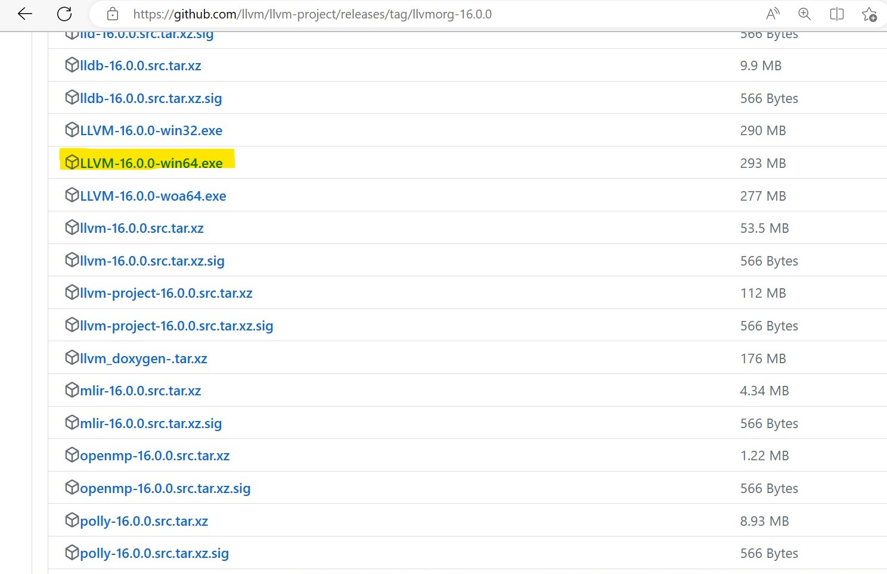
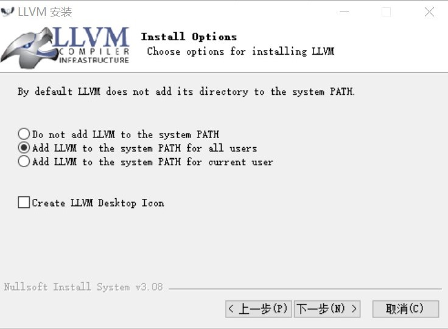
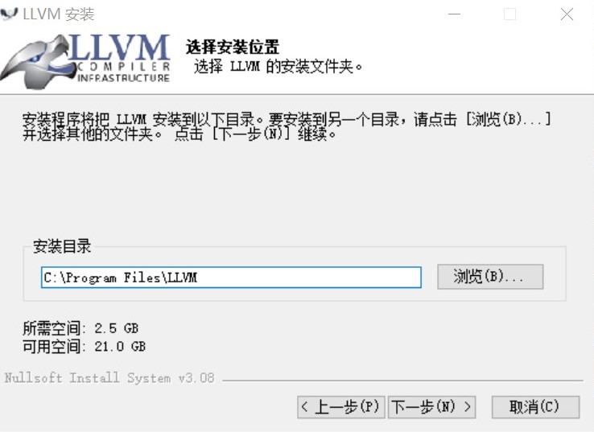
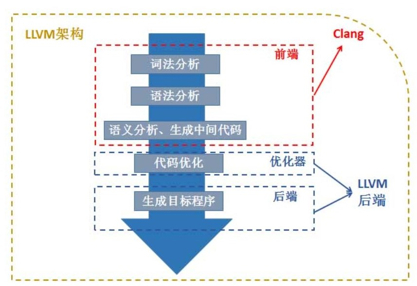
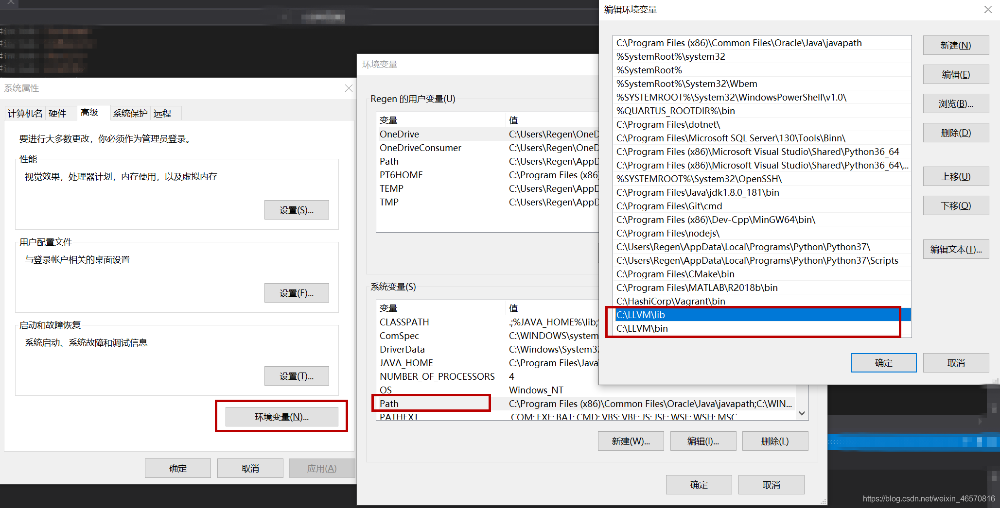

https://rust-lang.github.io/rust-bindgen/requirements.html

灰体字 不重要，赶时间可以不看

## FFI

FFI（Foreign Function Interface）是这样一种机制：用一种编程语言写的程序能调用另一种编程语言写的函数。（和下面关系不大，只是顺便提一下，看到这个词的时候心里有个底）

## bindgen是什么

一个为Rust设计的自动生成C/C++库的接口的工具，简而言之就是帮助你在rust里调用C/C++的函数。

## bindgen的环境搭建

#### 安装Clang

__windows__

第一步	安装：

可以直接去Clang官方网站下载（https://releases.llvm.org/download.html）(注意，选择安装llvm而不是Clang)，也可以用windows近年来推出的包管理器winget来安装

~~~shell
winget install LLVM.LLVM #不推荐，我试过挺慢的，而且也不知道会安装到哪去
~~~

经过测试发现还是直接在官方的github仓库下载比较快https://github.com/llvm/llvm-project/releases/tag/llvmorg-16.0.0

选择win64版本

>

安装时选择添加环境变量（这样子就不用自己添加了）

>

不要选默认路径，因为Program Files路径里有空格，可能会导致奇怪的问题，我改成了D:

>

winget：windows的包管理器，类似linux的apt，~~但是听说很鸡肋，只管装不管卸，没有uninstall选项，不如叫软件下载器得了。~~刚刚我自己在cmd里看了一下，发现我的win10已经内置了winget，不用另外安装（以前好像是要的）且已经加上了uninstall等其他功能。

llvm和Clang关系：广义的llvm指一种编译器框架系统（简单理解为一个编译器），见图中黄色区域；狭义的llvm指蓝色区域。也就是说，Clang是编译器LLVM（广义）的一部分，所以虽然我们要用Clang，但是这里安装的却是LLVM（知道怎么回事就行）

>

第二步	添加环境变量(如果第一步安装的时候选择了添加环境变量就可以跳过这步)：

将D:\LLVM\lib和D:\LLVM\bin（根据自己安装的位置调整）添加到环境变量Path，如图

>

__linux:__

~~~shell
$ apt install llvm-dev libclang-dev clang
~~~

## 如果使用bindgen

#### 使用

