# FreeRTOS改写与优化----结题报告

## 总述

我们的项目目标是利用高性能、高安全性的Rust语言对FreeRTOS嵌入式实时操作系统进行核心内容改写，并在改写的基础上加入MMU对原先的FreeRTOS结构进行优化。

我们的工作主要分为两个部分: **Rust改写**和**构建MMU**。

**Rust改写**部分中我们基于FreeRTOS手册，查询Rust语法网站，主要对task.c，list.c，queue.c三部分FreeRTOS核心代码进行改写，并同时改写了许多有关的附属源代码，总计约5000+行改写内容。同时一定程度上优化了原先的C语言代码结构，将一些冗杂的代码进行合并，并将面向过程的函数变为结构体方法。

**构建MMU**部分由于硬件使用过于复杂，我们采用了软件模拟的方法模拟MMU的运行，重点研究MMU的替换策略以及TLB对系统性能的影响。

我们每周都会进行一到两次的周常会议，汇报本周的工作内容并对下周进行规划。整个工作期间，我们每周都对工作内容进行了详细的分工，引入ddl机制，确保有效、有规划地稳步迈进，截至项目完成时，每个人都学习了独特的知识并做出了重要的贡献。

接下来，我们将依次对Rust改写部分和MMU构建部分进行详细的介绍。

Imagination小组成员：**杨宇航 王彦彬 林文浩 李浩宇 杨松菡**


## Rust改写

### 项目背景

     嵌入式系统诞生于20世纪70年代，最早应用于工业领域。作为信息技术革命的产物，它极大的提高了社会生产力。随着嵌入式系统应用到国防、航天、电力、医疗、通信、金融等领域，人们在处理速度、处理精度、实时性等方面对嵌入式系统提出了更高的要求，于是，实时操作系统(RTOS)在这种时代背景下应运而生。

#### 发展阶段：

##### 1.第一阶段  

   1980s ~ 2009年左右：RTOS主要是以本机MCU资源管理为主，MCU资源管理的优化及可扩展性等。

##### 2.第二阶段 

   2009年~2020年左右：物联网的产生和发展，拓展了RTOS的应用。尤其是伴随着通信连接技术，如Wi-Fi、蓝牙等为代表的无线技术迅速发展，众多的公司也推出了各种物联网平台，为物联网应用提供了强大的平台支撑，RTOS主要作用是在平台连接上。
##### 3.第三阶段 

   2020年以后：随着设备泛连接的发展，以及边缘计算的发生，设备间的互联及互联操作越来越多，需要一个安全可靠的RTOS来管理。设备互连将成为RTOS发展的一个重要方向。

#### 发展趋势：

1.
   RTOS内核向微型化、高可信、高可用、强实时、构件组装化发展；操作系统支撑开发环境向集成化、可调试化、支持模型驱动设计
   发展；
2. 面向领域特制的RTOS走向开放化、标准规范化、平台化，越来越多的行业标准出台；
3. 传感器网络技术进一步推动嵌入式技术与互联网技术的深层次耦合，嵌入式产品将成为互联网的主要终端之一，RTOS可能成为互联网接入设备的基础。
4. 设备智能化程度越来越高，MCU固件功能日益增多，而随着MCU性能不断地提升，可实现的应用功能也不断增加。同时，中间件或组件丰富和扩展也是RTOS发展的巨大推动力。
5. 人工智能（AI）技术不断地发展，RTOS将成为其关键的基础。

​    经过数十年的发展，RTOS已经产生了一套完整且成熟的理论体系。目前，国际上有数十家软件开发商涉足RTOS系统研发，市场上有多达上百种实时操作系统。在众多RTOS中，FreeRTOS、WinCE、VxWorks、μC/OS-Ⅱ等运用较广，而Linux在部分网络开发社区的改造下一定程度上也能成为实时操作系统。

​    本小组选择FreeRTOS作为调研和改进的对象。FreeRTOS是一个热门的嵌入式设备用即时操作系统核心，它于2003年由Richard Barry设计，并已被经成功移植到35种不同的微控制器上，采用MIT许可证许可。

#### FreeRTOS的优势在于：

##### 1.设计小巧且简易

   整个核心代码只有3到4个C文件，占用了较少的系统资源，是为数不多能够在小RAM单片机上运行的RTOS。

##### 2.代码可读性强

   为了让代码容易阅读、移植和维护，大部分的代码都是以C语言编写，只有一些函数采用汇编语言编写，拥有较强的可读性，对于本组的工作来说工作量适宜。

##### 3.免费开源

   最重要的一点在于，相对μC/OS-II、embOS等商业操作系统，FreeRTOS操作系统是完全免费的操作系统，具有源码公开、可移植、可裁减、调度策略灵活的特点，可以方便地移植到各种单片机上运行。

### 项目设计

#### 总体项目概述

我们首先从FreeRTOS官方网站下载FreeRTOS的C语言源码，经过前期分析，将主要分为Portable和General两个部分的代码进行切割，主要进行General部分的改写，一方面，这部分代码通用性较强，相较于可移植层更加能体现FreeRTOS操作系统的特点，另一方面，这部分代码与本学期操作系统的核心学习内容关系紧密，通过改写可以切实体会操作系统的核心功能。

FreeRTOS这部分核心代码分为task，queue，list三个主要部分和一些边缘代码，我们以单个函数为改写单位进行改写，以拼图的形式逐步构建与组合，在完成这部分改写之后，通过链接工具和剩余的C语言源码部分进行组合，从而实现一个拥有FreeRTOS基础功能的可编译内核。


#### 技术分析

##### Rust规则宏

Rust里面没有实用的#define，但是有功能极为强大的宏，规则宏是里面最简单的一类，可以用来替代C语言源码中的类似`#define MAX 100`这样的宏。例如：

```rust
#[macro_export]
macro_rules! MAX {
    () => 100
}
```

再添加参数之后，可以用更复杂一点的宏结构形成类似函数的功能，能够相应地替换C语言中的带有参数的`#define`结构：

```rust
#[macro_export]
macro_rules! sqr {
    ($x:expr) => {$x * $x}
}

fn main() {
    println!("{}", sqr!(1 + 1));
}
```

通过`#[macro_export]`将宏进行导出，并搭配`#[marco_use]`在需要使用的地方进行导入，可以方便地扩大宏的适用范围。

##### Rust 条件编译

条件编译是指根据某些条件来决定部分代码是否被视为源代码的一部分,即如果满足条件，这部分就会被编译，否则会被编译器无视，相当于不存在。

在Rust中使用`cfg`属性来有条件地编译函数：

```rust
#[cfg(target_os = "windows")]
fn are_you_on_windows() {
    println!("You are running windows!");
}
```

这与C语言中使用预处理器指令进行条件编译类似，可以有效地替换C语言源码中大量存在例如`#ifdef`和`#ifndef`的条件编译语句。

而且通过一些辅助形式以及随意嵌套的特性，比C语言的条件编译语句有更广的适用性：

```rust
     #[cfg(any(unix, windows))] //类似“或”

     #[cfg(all(unix, target_pointer_width = "32"))]	//类似“且”

     #[cfg(not(foo))] //类似“非”

     #[cfg(any(not(unix), all(target_os="macos", target_arch = "powerpc")))]
```

通过在Cargo.toml中的[features]对cfg后面括号内的配置选项进行设置，可以使Cargo传递给rustc一个标记，从而有效地进行条件编译了。

##### Arc, RwLock, Weak

这是 Rust 语言中用于**多线程编程**的标准库中的一些类型和模块。具体来说，它们分别表示：

- `Arc`：Atomic Reference Counted，即原子引用计数，用于在多个线程之间共享所有权。`Arc` 类型的值可以被多个线程持有，并且当所有持有者都释放时，该值才会被销毁。
- `RwLock`：Read-Write Lock，即**读写锁**，用于控制多个线程对共享数据的并发访问。`RwLock` 类型提供了两种锁定方式：读取锁和写入锁，允许多个线程同时读取数据，但只允许一个线程写入数据。
- `Weak`：弱引用，用于解决 `Arc` 中的循环引用问题。`Weak` 类型允许创建一个指向 `Arc` 类型值的弱引用，不会增加引用计数，因此可以避免循环引用导致的内存泄漏。

这些类型和模块在Rust改写C语言源码的过程中十分好用，`RwLock`可以有效地解决类似双向循环链表、多维数组的临界区多线程读写问题。`Arc`通过维护计数，对原先一一对应的所有权模式进行了补充，在链表这类指向复杂的数据结构中有广泛的应用。`Weak`通过弱引用的方式，有效解决了循环链表中复杂的循环引用问题，能够保证Rust自动释放空间的特性得以保留并正确地执行。

##### 特性代替函数指针

面对C语言中广泛存在的`void *` `Function_t`型的复杂指针，可以在Rust中利用特性进行替换：

```rust
fn output(object: impl Descriptive) {
    println!("{}", object.describe());
}
```

任何实现了 Descriptive 特性的对象都可以作为这个函数的参数，这个函数没必要了解传入对象有没有其他属性或方法，只需要它有 Descriptive 特性规范的方法就可以了。

从而对于一些C语言函数类型，可以定义一些复杂的特性，通过`extern "C"`和`c_void` `c_int`等数据类型的库，并对特性的对象进行层层嵌套，从而完成进行函数指针的替换：

```rust
extern "C" {
    fn do_something(f: Option<extern "C" fn(x: c_int, arg: *mut c_void) -> c_int>, arg: *mut c_void) -> c_int;
}

extern "C" fn do_something_handler(x: c_int, arg: *mut c_void) -> c_int {
    let closure: &mut &mut dyn FnMut(i32) -> bool = unsafe { mem::transmute(arg) };
    closure(x as i32) as c_int
}

pub fn do_with_callback<F>(x: i32, mut callback: F) -> bool
    where F: FnMut(i32) -> bool
{
    // reason for double indirection is described below
    let mut cb: &mut dyn FnMut(i32) -> bool = &mut callback;
    let cb = &mut cb;
    unsafe { do_something(Some(do_something_handler), cb as *mut _ as *mut c_void) > 0 }
}
```

##### 结构体方法

相比于上面这种较为复杂的函数指针替换方法，我们采取了另外一种方法来“逃避”面对大量的指针问题。

为此，我们一定程度上修改了原先的C语言代码结构，将原先独立的函数转化为挂载在相应结构体下的结构体方法:

```rust
impl TCB {
    pub fn AddTaskToReadyList(&self) -> Result<(), FreeRtosError> {
        //该任务本来就已经存在，只是可能从其他地方（比如阻塞队列）中移动到ReadyList
        //从Handle获取TCB
        let tcb = GetTCB_read!(self);
        let priority = self.GetPriority();
        //和当前最高Priority的任务比较,如果该taskhandle更高，就更新
        traceMOVED_TASK_TO_READY_STATE!(&tcb);
        RecordReadyPriority(priority);
        //插入链表end
        list::vListInsertEnd(
            &READY_TASK_LISTS[priority as usize],
            &Arc::clone(&Arc::clone(&tcb.StateListItem)),
        );
        tracePOST_MOVED_TASK_TO_READY_STATE!(&tcb);
        Ok(())
    }
}
```

如上图，将原先的指向TCB的结构体指针通过`&self`进行替代，而返回值利用`Result<(), FreeRtosError>`进行替换，并将原本存在的函数指针进行修改，将其在C语言中作为参数的形式改为在结构体方法内部直接调用函数或宏。通过以上等方法，将原本的C语言结构转化为了更加适用于Rust语言的结构，并且由于挂载在相应的结构体下，功能类似的函数更加密集，看起来结构更加清晰易懂。


##### 模块（Module）

Rust语言的组织单位是模块，可以层层包含，就像文件系统的目录结构一样。

```Rust
mod nation {
    mod government {
        fn govern() {}
    }
    mod congress {
        fn legislate() {}
    }
    mod court {
        fn judicial() {}
    }
}

crate::nation::government::govern();
```

类似目录结构往往以斜杠在路径字符串中表示对象的位置，Rust 中利用**::**作为路径分隔符，利用从 crate 关键字开始描述的绝对路径，和`use`引用外部模块，可以类似C语言的`#include`，方便地勾连起各个源代码，从而使函数、全局变量，能够在各个源代码之间公共使用。

```rust
pub mod fnnn
{
 pub fo()
}
```

```rust
 use crate::test1::fnnn
 use fnnn::fo
```

#### 

#### 技术路线

##### FreeRTOS手册

我们改写的基础，是FreeRTOS官网提供的FreeRTOS手册，上面提供了每一个C语言源码中的函数的详细介绍，包括简介、参数、返回值、批注和一些使用示例，很好地帮助我们了解每一个函数的用处和用法，详细的参数类型也为改写提供了很多方便。

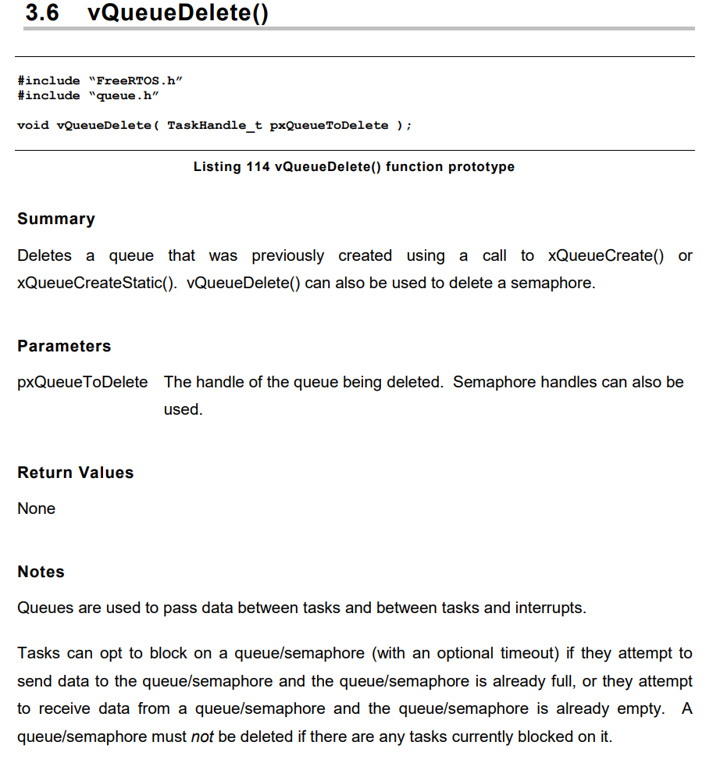

##### 命名惯例与数据类型

仅仅有函数的介绍还是不够的，因为FreeRTOS的源码中使用了大量Typedef对类型进行自定义，所以还需要知晓详细的命名惯例和数据类型，才能够充分了解函数参数、返回值的含义。

同样是通过FreeRTOS的官网的手册，将复杂的参数类型如`pUBaseType_t`解析为：“指向32位无符号数的函数指针”，并参考Rust手册，改写为相应的Rust数据类型，从而为改写打下基础。

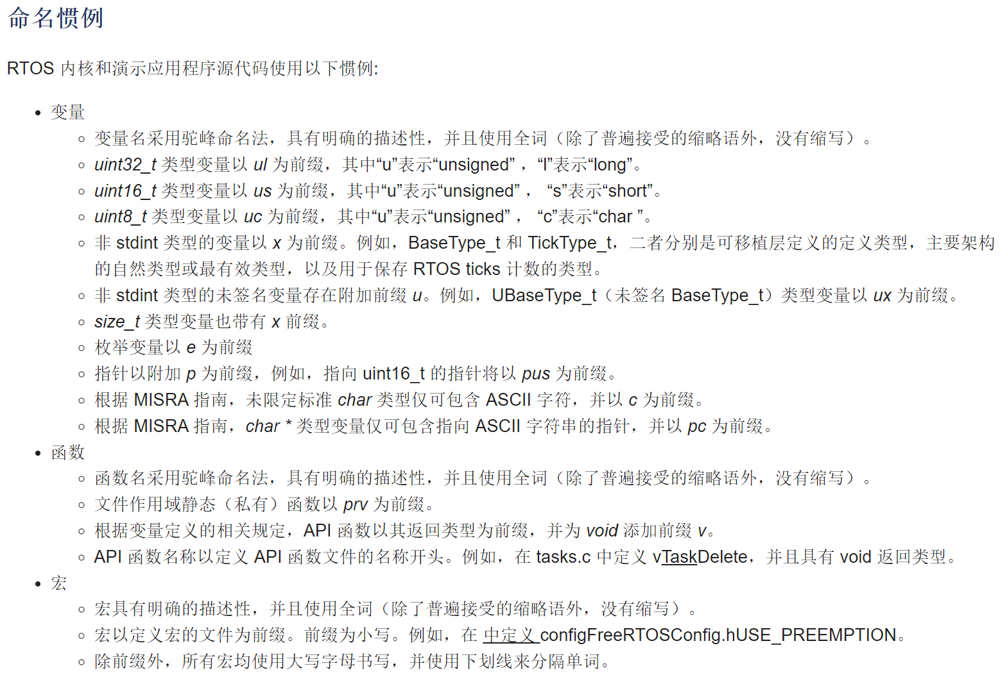

##### Bindgen：生成Rust的C语言FFI工具

bindgen是一个为Rust设计的自动生成C/C++库的接口的工具。通过安装之后在rust工程的build-dependncies中添加相应的配置就可以使用它。

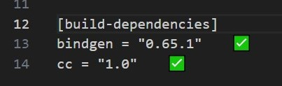

使用时需要在Rust工程中新建build.rs文件（文件名不可改，这个文件会在所有文件之前被编译）在该文件中指定C程序源码位置以及相应的头文件，并设置接口生成文件路径和名称

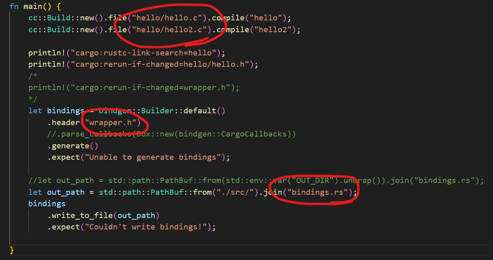

配置完成后进行cargo build，将自动生成相应的C语言接口，将bindings文件作为模块加入其他文件，用unsafe将接口再次包装，就可以得到可以直接使用的函数，值得注意的是C的接口包装出来的函数的行为和Rust的函数不一样，比如关于所有权的机制是和C类似的

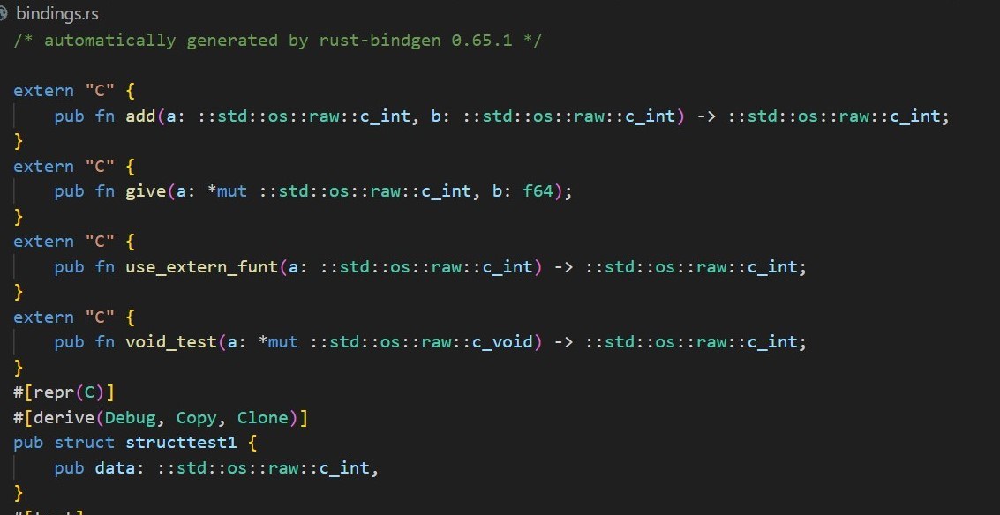

##### doc.rust-lang.org

这是Rust官方提供的Rust语法网站，上面罗列了有关Rust语法方方面面的信息，无论是库、数据类型，还是泛型、闭包、特性，都能在上面以搜索的形式进行查阅。

我们将其作为Rust语法字典，搭配ChatGPT和StackOverflow网站，能够解决大部分的Rust复杂语法问题。

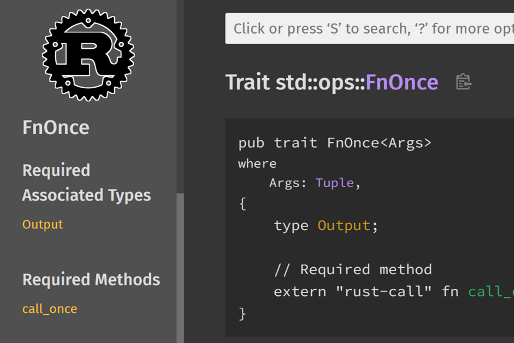


### 项目介绍

#### list.c

##### 简介
list 部分主要通过两个结构体实现一个双向链表。定义结构体 `ListItem_t` 与 `List_t` 。其中 `List_t` 用于管理链表，包括链表的长度，节点索引，最后一个节点等；而 `ListItem_t` 则为链表的成员，存储包括该成员所属的链表、TCB、前后的成员等，并实现一系列操作这些结构体的方法、函数等
`ListItem_t` 结构体如下所示：
```rust
#[derive(Debug)]
pub struct xLIST_ITEM
{
    // 辅助值，用于帮助结点做顺序排列
    xItemValue: TickType_t,		
    pxNext: WeakItemLink, 
    pxPrevious: WeakItemLink,	
    // 指向拥有该结点的内核对象，通常是TCB
    pvOwner: Weak<RwLock<TCB>>,
    // 指向该节点所在的链表 双向引用
    pvContainer: Weak<RwLock<List_t>>,				
}
```
`List_t` 结构体如下所示：
```rust
#[derive(Clone)]
pub struct xLIST
{
    // 链表节点计数器
    uxNumberOfItems: UBaseType_t,
    // 链表节点索引指针
    pxIndex: WeakItemLink,			
    // 指向链表最后一个节点 单向引用
    xListEnd: ItemLink ,							
}
```

##### 改写说明
1. 在 C 语言的基础上，使用 `impl` 实现链表的方法，如用于设置链表节点的值、所属链表等。如下所示，使用 `impl` 实现 `xLIST_ITEM` 的一系列方法
   ```rust
   impl xLIST_ITEM {
       pub fn new(item_value: TickType_t) -> Self {
           let mut item = ListItem_t::default();
           item.set_value(item_value);
           item
       }
   
       pub fn set_value(&mut self, item_value: TickType_t) {
           self.xItemValue = item_value;
       }
   
       pub fn owner(mut self, owner: TaskHandle) -> Self {
           self.pvOwner = owner.into();
           self
       }
   
       pub fn set_container(&mut self, container: &     Arc<RwLock<List_t>>) {
           self.pvContainer = Arc::downgrade(container);
       }
   
       fn remove(&mut self, link: WeakItemLink) ->      UBaseType_t {
           /* The list item knows which list it is in.       Obtain the list from the list
           item. */
           let list = self
               .pvContainer
               .upgrade()
               .unwrap_or_else(|| panic!("Container not      set"));
           let ret_val = list
               .write()
               .unwrap()
               .remove_item(&self, link);
           set_list_item_next(&self.pxPrevious, Weak::clone(&     self.pxNext));
           set_list_item_prev(&self.pxNext, Weak::clone(&     self.pxPrevious));
           self.pvContainer = Weak::new();
           ret_val
       }
   }
   ```
2. 由于双向链表，以及链表与成员之间需要相互引用， Rust 无法直接实现（限制只能有一个拥有者），故在结构体的基础上外包一层 RwLock（读写锁，用于管理对对象的更改读取等）和 Arc / Weak （实现可以有多个引用者并预防内存无法释放）。如下所示：
   ```rust
   pub type ListItem_t = xLIST_ITEM;	
   pub type ItemLink = Arc<RwLock<ListItem_t>>;
   pub type WeakItemLink = Weak<RwLock<ListItem_t>>;
   
   pub type List_t = xLIST;
   pub type ListLink = Arc<RwLock<List_t>>;
   pub type WeakListLink = Weak<RwLock<List_t>>;
   ```
3. 在获取 next 或 previous 、获取链表长度等操作时，也需要先对包有 RwLock 、 Arc / Weak 的对象解引用、判断是否为空等（如 upgrade()、 unwrap_or_else()）。此外对一些繁复的操作专门另写一些函数，使用时调用即可（如获取 next 成员）。如下示例得到链表成员的 next 的操作等
   ```rust
   fn get_list_item_next(item: &WeakItemLink) -> WeakItemLink {
       let owned_item = item
           .upgrade()
           .unwrap_or_else(|| panic!("List item is None"));
       let next = Weak::clone(&(*owned_item.read().unwrap()).pxNext);
       next
   }
   
   fn get_list_item_prev(item: &WeakItemLink) -> WeakItemLink {
       let owned_item: Arc<RwLock<xLIST_ITEM>> = item
           .upgrade()
           .unwrap_or_else(|| panic!("List item is None"));
       let prev = Weak::clone(&(*owned_item.read().unwrap()).pxPrevious);
       prev
   }
   
   // get_list_item_value
   pub fn listGET_LIST_ITEM_VALUE(item: &ItemLink) -> TickType_t {
       (*item.read().unwrap()).xItemValue
   }
   ```
4. 通过之前介绍的函数、方法等，实现对链表的操作，如下展示对链表插入节点
   ```rust
   // insert before pxIndex
   pub fn vListInsertEnd(list: &ListLink, item_link: &ItemLink) {
       // 将节点的所属链表设为希望插入的链表
       item_link.write().unwrap().set_container(&list);
       
       // 调用 list 实现的方法，将节点插入链表
       list.write().unwrap().insert_end(Arc::downgrade(&item_link))
   }
   ```

#### task.c

##### 简介

task部分主要与任务调度有关，利用list.c部分生成的结构体和结构体方法，生成并维护多个任务列表：Ready List, Delay List, Suspend List, Overflow List等等，与操作系统书中所写的任务状态--Ready、Blocked、Running、Terminated等一一对应，任务调度器通过链表指针遍历循环链表，从而实现任务切换与调度。

原本的C语言源码中，这部分代码主要对TCB(Task Control Block)和它的句柄TaskHandle进行操作，我们在改写过程中重新设计了TCB和TaskHandle结构体结构，作为List基本单元的核心组件和任务调度的基本单位，并将原先大量操作TCB和TaskHandle的函数（将TCB和TaskHandle的指针作为函数参数）改写为结构体方法。

##### 改写说明

在改写的过程中遵循层次化和层层抽象的设计方法。

首先定义两个核心结构体TCB和TaskHandle：

```rust
#[derive(Debug)]
pub struct TCB {
    //* basic information
    StateListItem: ItemLink,
    EventListItem: ItemLink,
    TaskName: String,
    StackDepth: UBaseType_t,
    Priority: UBaseType_t,
    StackPointer: StackType_t,

    #[cfg(feature = "portCRITICAL_NESTING_IN_TCB")]
    CriticalNesting: UBaseType_t,
    BasePriority: UBaseType_t,
    #[cfg(feature = "configUSE_MUTEXES")]
    MutexedHeld: UBaseType_t,
    #[cfg(feature = "configGENERATE_RUN_TIME_STATS")]
    RuntimeCounter: TickType_t,
    #[cfg(feature = "configUSE_TASK_NOTIFICATIONS")]
    NotifiedValue: u32,
    #[cfg(feature = "configUSE_TASK_NOTIFICATIONS")]
    NotifyState: u8,
    #[cfg(feature = "INCLUDE_xTaskAbortDelay")]
    DelayAborted: bool,
}

#[derive(Clone)]
pub struct TaskHandle(Arc<RwLock<TCB>>);
```

在此基础上定义new,from等初始化方法，和一些对结构体成员进行操作的简单方法，比如SetPriority,GetEventListItem等：

```rust
pub fn SetPriority(mut self, priority: UBaseType_t) ->  Self {
        if priority >= configMAX_PRIORITIES!() {
            warn!("优先级大于了设定的最大优先级！");
            info!(
                "设定的最大优先级为 {}, 但是所设定的为 {}",
                configMAX_PRIORITIES!() - 1,
                priority
            );
            self.Priority = configMAX_PRIORITIES!() - 1;
        } else {
            self.Priority = priority;
        }
        self
    }
```

在以上代码基础上进行抽象，搭建上一层次的代码，比如AddTaskToReadyList，AddCurrentTaskToDelayedList等，主要实现了TCB在不同List之间的切换，即使任务切换状态并维护相关变量：

```rust
    pub fn AddTaskToReadyList(&self) -> Result<(), FreeRtosError> {
        //该任务本来就已经存在，只是可能从其他地方（比如阻塞队列）中移动到ReadyList
        //从Handle获取TCB
        let tcb = GetTCB_read!(self);
        let priority = self.GetPriority();
        //和当前最高Priority的任务比较,如果该taskhandle更高，就更新
        traceMOVED_TASK_TO_READY_STATE!(&tcb);
        RecordReadyPriority(priority);
        //插入链表end
        list::vListInsertEnd(
            &READY_TASK_LISTS[priority as usize],
            &Arc::clone(&Arc::clone(&tcb.StateListItem)),
        );
        tracePOST_MOVED_TASK_TO_READY_STATE!(&tcb);
        Ok(())
    }
```

自然地，这部分代码中除了对TCB所在的List单元进行处理，调用List插入、删除相关方法外，还需要对一系列全局变量进行处理，比如当前所有任务中最高的优先级`TOP_READY_PRIORITY` 当前任务总数量`TASK_NUMBER`等，所以需要相应地维护一个`global.rs` 源代码，用于进行全局变量声明和相关操作函数、宏的定义：

```rust
//定义全局变量
pub static mut TICK_COUNT: TickType = 0;
pub static mut TOP_READY_PRIORITY: UBaseType = 0;//所有Ready任务中，最高的优先级
pub static mut PENDED_TICKS: UBaseType = 0;
pub static mut SCHEDULER_RUNNING: bool = false;
pub static mut YIELD_PENDING: bool = false;
pub static mut NUM_OF_OVERFLOWS: BaseType = 0;
pub static mut TASK_NUMBER: UBaseType = 0;
pub static mut NEXT_TASK_UNBLOCK_TIME: TickType = 0;
pub static mut CURRENT_NUMBER_OF_TASKS: UBaseType = 0;
```

同时，利用`lazy_static!`宏，对一些复杂数据结构进行初始化：

```rust
//lazy_static! 是一个 Rust 宏，相比原始的在编译时初始化静态变量，它可以在运行时初始化静态变量
//需要在运行时才能初始化的静态变量包括任何需要堆分配的内容，如向量或哈希映射，以及任何需要函数调用才能计算的内容
lazy_static! {
    //当前任务的TCB
    pub static ref CURRENT_TCB: RwLock<Option<TaskHandle>> = RwLock::new(None);

    //Ready List，没什么好说的
    pub static ref READY_TASK_LISTS: [ListLink; configMAX_PRIORITIES!()] = Default::default();

   //分别用于存储延迟任务和溢出延迟任务
    pub static ref DELAYED_TASK_LIST: ListLink = Default::default();
    pub static ref OVERFLOW_DELAYED_TASK_LIST: ListLink = Default::default();

    //存储在调度程序挂起时已准备就绪的任务
    pub static ref PENDING_READY_LIST: ListLink = Default::default();
}
```


#### queue.c

##### 主要结构体为：

```rust
struct QueueDefinition<T>
    where
        T: Default + Clone
{
    pcQueue: VecDeque<T>,

    pcHead: UBaseType,
    pcTail: UBaseType,
    pcWriteTo: UBaseType,

    QueueUnion: UBaseType,

    xTasksWaitingToSend: ListLink,
    xTasksWaitingToReceive: ListLink,

    uxMessagesWaiting: UBaseType,
    uxLength: UBaseType,
    cRxLock: i8,
    cTxLock: i8,

    #[cfg(all(
    feature = "configSUPPORT_STATIC_ALLOCATION",
    feature = "configSUPPORT_DYNAMIC_ALLOCATION"
    ))]
    ucStaticallyAllocated: u8,

    #[cfg(feature = "configUSE_QUEUE_SETS")]
    pxQueueSetContainer: Option<Box<QueueDefinition>>,

    #[cfg(feature = "configUSE_TRACE_FACILITY")]
    uxQueueNumber: UBaseType,
    ucQueueType: QueueType,
}
```

##### queue主要实现了以下主要函数：

```rust
fn xQueueCreate(length: UBaseType_t) -> Self
```

```rust
fn xQueueSend(&self, pvItemToQueue: T, xTicksToWait: TickType) -> Result<(), QueueError>
```

```rust
fn xQueueSendToFront(&self, pvItemToQueue: T, xTicksToWait: TickType, ) -> Result<(), QueueError>
```

```rust
fn xQueueSendToBack(&self, pvItemToQueue: T, xTicksToWait: TickType) -> Result<(), QueueError>
```

```rust
fn xQueueOverwrite(&self, pvItemToQueue: T) -> Result<(), QueueError>
```

```rust
fn xQueueSendToFrontFromISR(&self, pvItemToQueue: T) -> (Result<(), QueueError>, bool)
```

```rust
fn xQueueSendToBackFromISR(&self, pvItemToQueue: T) -> (Result<(), QueueError>, bool)
```

```rust
fn xQueueOverwriteFromISR(&self, pvItemToQueue: T) -> (Result<(), QueueError>, bool)
```

```rust
fn xQueueReceive(&self, xTicksToWait: TickType) -> Result<T, QueueError>
```

```rust
fn xQueuePeek(&self, xTicksToWait: TickType) -> Result<T, QueueError>
```
包括了创建队列，以及向队列发送消息、从队列接收消息两种基本功能的多种模式。

##### 核心功能实现代码：
```rust
    pub fn prvQueueGenericCreate(uxQueueLength: UBaseType, ucQueueType: QueueType) -> Self {
        let mut queue: QueueDefinition<T> = Default::default();
        queue.pcQueue = VecDeque::with_capacity(uxQueueLength as usize);
        queue.prvInitialiseNewQueue(uxQueueLength, ucQueueType);
        queue
    }

    pub fn prvInitialiseNewQueue(&mut self, uxQueueLength: UBaseType, ucQueueType: QueueType) {
        self.pcHead = 0;
        self.uxLength = uxQueueLength;
        self.xQueueGenericReset(true);

        self.ucQueueType = ucQueueType;
    }
```

```rust
    pub fn xQueueGenericSend(
        &mut self,
        pvItemToQueue: T,
        xTicksToWait: TickType,
        xCopyPosition: BaseType,
    ) -> Result<(), QueueError> {
        let mut xEntryTimeSet: bool = false;
        let mut xTimeOut: time_out = Default::default();
        let mut xTicksToWait = xTicksToWait;

        assert!(!((xCopyPosition == queueOVERWRITE) && self.uxLength == 1));

        #[cfg(all(feature = "xTaskGetSchedulerState", feature = "configUSE_TIMERS"))]
        assert!(
            !((kernel::task_get_scheduler_state() == SchedulerState::Suspended)
                && (xTicksToWait != 0))
        );
        loop {
            {
                if self.uxMessagesWaiting < self.uxLength || xCopyPosition == queueOVERWRITE {
                    self.prvCopyDataToQueue(pvItemToQueue, xCopyPosition);
                    #[cfg(feature = "configUSE_QUEUE_SETS")]
                    match self.pxQueueSetContainer {
                        Some => {
                            if notify_queue_set_container(&self, &xCopyPosition) != false {
                                queueYIELD_IF_USING_PREEMPTION!();
                            } else {
                                mtCOVERAGE_TEST_MARKER!();
                            }
                        }
                        None => {
                            if list::list_is_empty(&self.xTasksWaitingToReceive) == false {
                                if task_queue::task_remove_from_event_list(
                                    &self.xTasksWaitingToReceive,
                                ) {
                                    queueYIELD_IF_USING_PREEMPTION!();
                                } else {
                                    mtCOVERAGE_TEST_MARKER!();
                                }
                            }
                        }
                    }

                    {
                        #[cfg(not(feature = "configUSE_QUEUE_SETS"))]
                        if !list::listLIST_IS_EMPTY(&self.xTasksWaitingToReceive) {
                            if task_queue::xTaskRemoveFromEventList(&self.xTasksWaitingToReceive)
                            {
                                //queueYIELD_IF_USING_PREEMPTION!();
                            } else {
                                //mtCOVERAGE_TEST_MARKER!();
                            }
                        } else {
                            //mtCOVERAGE_TEST_MARKER!();
                        }
                    }
                    //taskEXIT_CRITICAL!();
                    return Ok(());
                } else {
                    {
                        #[cfg(feature = "configUSE_MUTEXES")]
                        if self.ucQueueType == QueueType::Mutex || self.ucQueueType == QueueType::RecursiveMutex {
                            taskENTER_CRITICAL!();
                            {
                                let task_handle = self.transed_task_handle_for_mutex();
                                task_queue::task_priority_inherit(task_handle);
                            }
                            taskEXIT_CRITICAL!();
                        } else {
                            mtCOVERAGE_TEST_MARKER!();
                        }
                    }
                    if xTicksToWait == 0 as TickType {
                        //taskEXIT_CRITICAL!();
                        //traceQUEUE_SEND_FAILED!(&self);
                        //trace!("Queue Send: QueueFull");
                        return Err(QueueError::QueueFull);
                    } else if !xEntryTimeSet {
                        task_queue::vTaskSetTimeOutState(&mut xTimeOut);
                        xEntryTimeSet = true;
                    } else {
                        //mtCOVERAGE_TEST_MARKER!();
                    }
                }
            }
            //taskEXIT_CRITICAL!();
            kernel::TaskSuspendAll();
            self.prvLockQueue();
            if !task_queue::xTaskCheckForTimeOut(&mut xTimeOut, &mut xTicksToWait) {
                if self.prvIsQueueFull() {
                    //traceBLOCKING_ON_QUEUE_SEND!(&self);
                    //trace!("queue_generic_send place on event list");
                    task_queue::vTaskPlaceOnEventList(&self.xTasksWaitingToSend, xTicksToWait);
                    self.prvUnlockQueue();
                    if !kernel::TaskResumeAll() {
                        //portYIELD_WITHIN_API!();
                    }
                } else {
                    self.prvUnlockQueue();
                    kernel::TaskResumeAll();
                }
            } else {
                self.prvUnlockQueue();
                kernel::TaskResumeAll();

                //traceQUEUE_SEND_FAILED!(self);
                return Err(QueueError::QueueFull);
            }
        }
    }
```
```rust
pub fn xQueueGenericReceive(
        &mut self,
        mut xTicksToWait: TickType,
        xJustPeeking: bool,
    ) -> Result<T, QueueError> {
        let mut xEntryTimeSet: bool = false;
        let mut xTimeOut: time_out = Default::default();
        let mut xYieldRequired: bool = false;
        let mut buffer: Option<T>;
        assert!(
            !((kernel::task_get_scheduler_state() == SchedulerState::Suspended)
                && (xTicksToWait != 0))
        );
        loop {
            //taskENTER_CRITICAL!();
            {
                let uxMessagesWaiting: UBaseType = self.uxMessagesWaiting;
                //trace!(
                    "queue_generic_receive: uxMessageWaiting: {}",
                    uxMessagesWaiting
                );
                if uxMessagesWaiting > 0 as UBaseType {
                    let pcOriginalReadPosition: UBaseType = self.QueueUnion; //QueueUnion represents pcReadFrom
                    buffer = self.prvCopyDataFromQueue(); //
                    if xJustPeeking == false {
                        traceQUEUE_RECEIVE!(&self);
                        self.uxMessagesWaiting = uxMessagesWaiting - 1;

                        {
                            /*if uxQueueType == queueQUEUE_IS_MUTEX*/
                            if self.ucQueueType == QueueType::Mutex
                                || self.ucQueueType == QueueType::RecursiveMutex
                            {
                                let task_handle = self.transed_task_handle_for_mutex();
                                xYieldRequired = task_queue::vTaskPriorityInherit(task_handle);
                                self.pcQueue.pop_front();
                            } else {
                                mtCOVERAGE_TEST_MARKER!();
                            }
                        }
                        trace!("queue_generic_receive -- line 498");
                        if list::listLIST_IS_EMPTY(&self.xTasksWaitingToSend) == false {
                            if task_queue::xTaskRemoveFromEventList(&self.xTasksWaitingToSend)
                                != false
                            {
                                queueYIELD_IF_USING_PREEMPTION!();
                            } else {
                                trace!("queue_generic_receive -- line 504");
                                mtCOVERAGE_TEST_MARKER!();
                            }
                        } else if xYieldRequired == true {
                            queueYIELD_IF_USING_PREEMPTION!();
                        } else {
                            trace!("queue_generic_receive -- line 508");
                            mtCOVERAGE_TEST_MARKER!();
                        }
                    } else {
                        traceQUEUE_PEEK!(&self);
                        self.QueueUnion = pcOriginalReadPosition;
                        if list::listLIST_IS_EMPTY(&self.xTasksWaitingToReceive) != false {
                            if task_queue::xTaskRemoveFromEventList(&self.xTasksWaitingToReceive)
                                != false
                            {
                                queueYIELD_IF_USING_PREEMPTION!();
                            } else {
                                mtCOVERAGE_TEST_MARKER!();
                            }
                        } else {
                            mtCOVERAGE_TEST_MARKER!();
                        }
                    }
                    taskEXIT_CRITICAL!();
                    trace!("queue_generic_receive -- line 529");
                    return Ok(buffer.unwrap_or_else(|| panic!("buffer is empty!")));
                } else {
                    if xTicksToWait == 0 as TickType {
                        taskEXIT_CRITICAL!();
                        traceQUEUE_RECEIVE_FAILED!(&self);
                        return Err(QueueError::QueueEmpty);
                    } else if xEntryTimeSet == false {
                        task_queue::vTaskSetTimeOutState(&mut xTimeOut);
                        xEntryTimeSet = true;
                    } else {
                        mtCOVERAGE_TEST_MARKER!();
                    }
                }
            }
            taskEXIT_CRITICAL!();
            trace!("queue_generic_receive -- line 553");
            kernel::TaskSuspendAll();
            self.prvLockQueue();
            trace!("queue_generic_receive -- line 556");
            if task_queue::xTaskCheckForTimeOut(&mut xTimeOut, &mut xTicksToWait) == false {
                if self.prvIsQueueEmpty() != false {
                    traceBLOCKING_ON_QUEUE_RECEIVE!(&self);
                    task_queue::vTaskPlaceOnEventList(
                        &self.xTasksWaitingToReceive,
                        xTicksToWait,
                    );
                    self.prvUnlockQueue();
                    if kernel::TaskResumeAll() == false {
                        portYIELD_WITHIN_API!();
                    } else {
                        mtCOVERAGE_TEST_MARKER!();
                    }
                } else {
                    self.prvUnlockQueue();
                    kernel::TaskResumeAll();
                }
                trace!("queue_generic_receive -- line 589");
            } else {
                self.prvUnlockQueue();
                kernel::TaskResumeAll();
                if self.prvIsQueueEmpty() != false {
                    traceQUEUE_RECEIVE_FAILED!(&self);
                    return Err(QueueError::QueueEmpty);
                } else {
                    mtCOVERAGE_TEST_MARKER!();
                }
            }
        }
    }
```
### 项目测试

#### 核心代码测试

我们只改写了部分核心代码，剩余代码全部进行改写任务量过大，只能利用bindgen工具进行链接形成总体，所以无法直接使用FreeRTOS官方提供的测试完整的内核的测试代码，只能阅读我们改写部分的测试代码，结合我们自己的改写，对三部分核心代码的数据结构和功能进行测试，下面为部分测试部分截取：

**测试list相关功能：**

通过编写一个遍历函数 `traverse()` 来测试所写程序。建立一个链表，并通过调用所写函数对其进行插入、删除、改值等操作，再调用 `traverse()` 遍历操作后的链表，验证正确性，以此实现测试
测试结果如下：
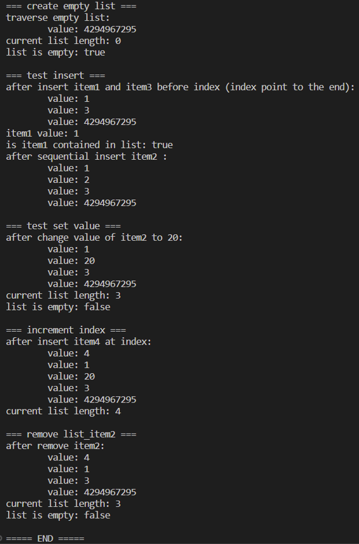
经验证，该部分程序正确

测试queue相关功能：

测试程序：
创建一个接收者和一个发送者，测试消息队列的功能

```rust
fn test_queue() {
    let q_recv = Arc::new(QueueDefition::prvQueueGenericCreate(10));
    let q_sender = Arc::clone(&q_recv);
    let _ = TermLogger::init(LevelFilter::Trace, Config::default());
    // 发送数据的任务代码。
    let sender = move || {
        for i in 1..11 {
            // send方法的参数包括要发送的数据和ticks_to_wait
            q_sender.send(i, pdMS_TO_TICKS!(50)).unwrap();
        }
        loop {
        }
    };
    // 接收数据的任务代码。
    let receiver = move || {
        let mut sum = 0;
        loop {

            if let Ok(x) = q_recv.receive(pdMS_TO_TICKS!(10)) {
                println!("{}", x);
                sum += x;
            } else {
                trace!("receive END");
                // 若等待30ms仍未收到数据，则认为发送结束。
                //assert_eq!(sum, 55);
                kernel::task_end_scheduler();
            }
        }
    };
    // 创建这两个任务。
    let _sender_task = tasks::TCB::new()
        .name("Sender")
        .priority(3)
        .initialise(sender);
    let _receiver_task = tasks::TCB::new()
        .name("Receiver")
        .priority(3)
        .initialise(receiver);
    kernel::task_start_scheduler();
}
```

测试结果：
开始发送
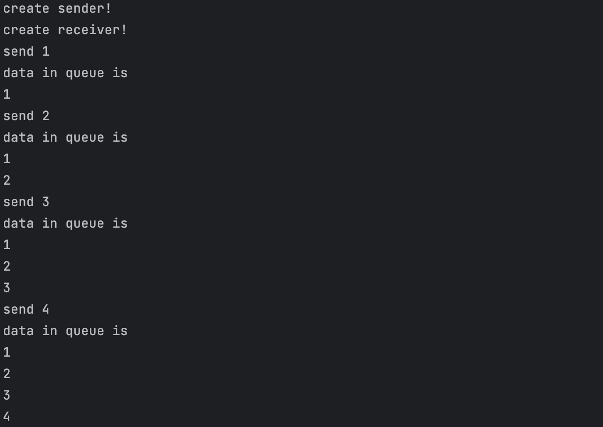
停止接收
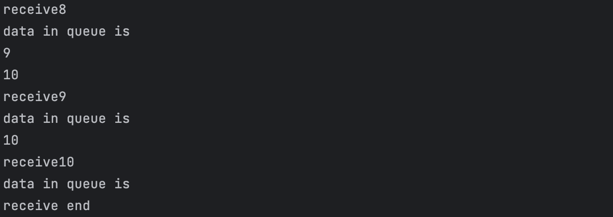

#### 代码覆盖率测试

代码覆盖率指运行测试之后，代码被覆盖到了多少，哪些代码跑了，哪些没有跑。可以帮助我们分析未覆盖部分的代码，从而反推前期测试设计是否充分，检测出程序中的废代码，可以逆向反推在代码设计中思维混乱点，帮助理清代码逻辑关系，提升代码质量。

对于没有方便benchmark直接进行测试的FreeRTOS，和只能进行核心功能测试的改写源码，我们决定添加代码覆盖率测试来一定程度上佐证代码的正确性，作为测试代码的补充。

同时，FreeRTOS官方文档中关于测试的介绍也提到了代码覆盖率测试，一种测试方法就是利用GCOV和mtCOVERAGE_TEST_MARKER()对C语言源码进行测试。

相比C语言源码的测试方法，我们利用工具GRCOV进行测试，首先清理构建目录并设置一些环境变量，之后安装辅助插件：如rust-analyzer、Coverage Gutters等，然后利用测试代码，用#[test]对需要测试的部分进行标记，最后利用cargo test进行测试：

```rust
cargo install grcov

cargo clean
set CARGO_INCREMENTAL = 0
set RUSTFLAGS=-Zinstrument-coverage

cargo test grcov . -s . --binary-path ./target/debug/ -t html --branch --ignore-not-existing -o ./coverage/
```


下面为对list测试代码进行代码覆盖率测试的结果：


## mmu模块

### mmu的作用

**MMU(Memory Management Unit)**即内存管理单元，是一种负责处理CPU内存访问请求的CPU可选硬件，在现代 CPU 中广泛使用。MMU有多种功能：对内存地址的访问进行控制，对代码段只读权限控制，对多线程的栈内存之间的空洞页进行隔离以防止栈溢出后改写其他线程的栈内存，不同进程之间的地址隔离(**内存保护**)等等。但MMU主要负责的还是虚拟地址与物理地址的转换(**地址映射**)，提供硬件机制的内存访问授权。

为了高效简便地解决应用程序太大以至于内存容纳不下该程序的问题，虚拟存储器诞生了，同时，为了合理地控制虚拟存储单元和物理存储单元的映射，人们创造了MMU以便进行有效的管理。

#### 虚拟内存

**虚拟内存**是计算机系统内存管理的一种技术。它使得应用程序认为它拥有连续可用的内存，而实际上物理内存通常被分隔成多个内存碎片，还有部分暂时存储在外部磁盘存储器上，在需要时进行数据交换。与没有使用虚拟内存技术的系统相比，使用这种技术使得大型程序的编写变得更容易，对真正的物理内存的使用也更有效率。

对虚拟内存的定义是基于对地址空间的重定义的，即把地址空间定义为“连续的虚拟内存地址”，以借此“欺骗”程序，使它们以为自己正在使用一大块的“连续”地址。

#### MMU工作过程

大多数使用虚拟存储器的系统都使用一种称为**分页(paging)的技术。虚拟地址空间划分成称为页(page)的单位，而相应的物理地址空间也被进行划分，单位是页框(frame)**。页和页框的大小必须相同。

每一页首先有一个用来标识它的页号，且有两个重要信息量，分别是**Present位**和**页框索引(Frame Index)**，位P(1有效)指出该页是否存在有效的映射，而页框索引指明该页向哪个物理页框进行映射。对于该页中的每一个虚拟地址，都被截断为两个部分，高位部分是**页号索引(page Index)**，低位则是相对该页首地址的**偏移量(offset)**。

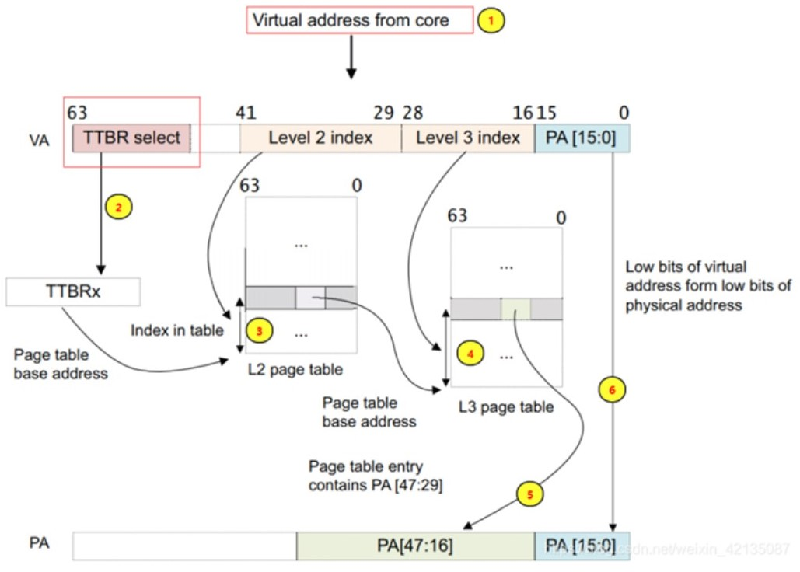

下面利用伪代码进行举例说明：

> MOVE REG, A0

该指令表示将地址A0处的内容传递进寄存器REG，MMU有以下几种情况：

1. MMU接收地址A0，检测位p，若Present = 1，说明虚拟地址A0所在页存在物理映射，设该页首地址为A1，MMU通过页框索引找到相应页框的首地址A2，保留A0的偏移量并修改页号索引为页框索引，即可达到(A0 - A1) + A2的效果，最终映射到正确的物理地址。
2. 若Present = 1，说明虚拟地址A0所在页无有效映射，于是通知CPU发生一个**缺页故障(page fault)**。操作系统将会介入，从有限的物理页框中找到1个当前很少被使用的页框并把该页框的内容写入外围存储器(page copy)，随后需要修改新、旧两页的页框索引和位p，把新页映射到刚才释放的页框中，结束后，重新执行产生故障的指令。

#### TLB

**TLB(Translation Lookaside Buffer)为CPU的一种高速缓存，用于存放将虚拟地址映射至物理地址的映射转换表的遍历结果**，这个结构是为了改进内存管理单元从虚拟地址到物理地址的转译速度而设计的。

当存储器中的转换表被改变或选中了不同的转换表，MMU就会刷新TLB。当访问存储器时，MMU 先查找 TLB ，如果命中，则按上述流程执行，如果没有命中，则会再去存储器中遍历转换表，寻找对应的映射(Table Walk)，并将利用遍历结果更新TLB。

### mmu的重要性

MMU负责协助操作系统共同完成虚拟地址到物理地址的映射，有了mmu才能实现虚拟内存的管理、内存的读写保护等功能。带有mmu模块的操作系统可以十分方便地实现多任务，并有很好的进程隔离机制。mmu已经成为现代mmu的标配，甚至有的人认为，mmu是区别mcu和cpu的重要标志之一，这足以体现mmu的重要性。

### 为FreeRTOS拓展mmu模块的必要性及可行性

随着半导体行业的不断发展，如今嵌入式设备的性能已经大大超过以前。从前人们出于成本考虑对于嵌入式设备不必增添mmu的想法正在逐渐瓦解。近年来越来越多需求表面，嵌入式的内核在未来可能会与应用进程开发相分离，如果有了mmu的虚存管理，用户就可以在一款内核上随意添加所需求的功能任务进程。另一方面，机器人行业在近年发展迅速，单一的不带mmu的mcu恐怕难以胜任复杂的应用环境，在这方面，操作系统的mmu模块也大有可为。

为FreeRTOS增加mmu模块，是十分符合现实的。FreeRTOS广泛应用于ARM架构的机器上，可移植性强。ARM不仅为64位机器提供mmu，在ARMv7-A系列架构中，也有32位机器增加了mmu硬件支持。这为FreeRTOS拓展mmu模块打下了基础。

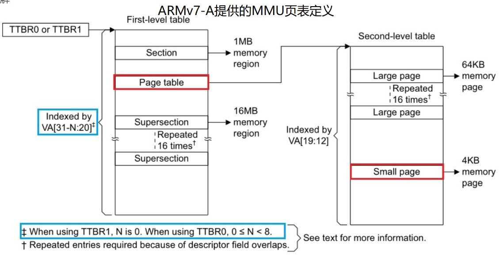

### 实现路线

#### 写MMU模块时遇到的困难

- 在ARM架构中，只有Cortex-A架构才具备MMU的硬件支持，该架构较Cortex-M复杂，手册内容过于繁杂。我们查找了很多资料，始终无法找到硬件MMU的使用方法。
- 对MMU的操作需要涉及底层汇编，如果需要和Rust结合进行交叉编译，实现起来较为困难，难以找到对应的IDE和相关工具的支持。因为我们只是改写了FreeRTOS的核心代码，其外围还有大量的c语言代码，而写MMU模块时会使用很多的汇编语言，我们没有找到可以同时对rust，c和汇编语言进行交叉编译的IDE。
- FreeRTOS本身未曾考虑虚拟内存相关功能，如果要添加需要对整体架构进行重构。例如：FreeRTOS中的任务控制块（TCB）中需要页表地址，在初始化TCB时需要分配页表，在任务切换时需要考虑TLB的更新。工作量太大，短期内难以实现。
- 虚拟内存的实现涉及虚实地址映射，将使得Debug极为困难。在使用MMU之后，程序使用虚拟地址，我们难以知晓物理内存中的状况。

#### 替代方案

介于写MMU模块时遇到的诸多困难，我们决定舍弃MMU硬件，使用软件模拟MMU的运行方式，在此基础上，只研究页表替换策略以及TLB对程序性能的影响。相当于只给出MMU的顶层代码，方便后来者进行参考和移植。

方法如下：

- 创建两段空间分别存放内存和外存的数据

  分配两段空间充当内存和外存，外存的空间要远大于内存，假定每个进程数据的虚拟空间要大于内存空间而小于外存空间，那么只能把进程的部分数据装入内存，剩下的存储在外存中。

  ```c
  #define disk_size (4096 * 8) 		//外存大小
  #define memory_size (1024 * 8)   	//内存大小
  #define virtual_space (2048 * 8) 	//虚拟地址空间
  ```

- 所有MMU的行为均用软件模拟，包括快表的查询、替换、慢表的查找……

  ```c
  int TLB_search(int virtual_address, memory_operation operation);//快表的查找
  int TLB_update(int page_number, int frame_number);//快表的更新
  void pageFault(entry * faultPage, int page_number);//缺页中断
  int address_map(int virtual_address, memory_operation operation);//虚拟地址映射
  ```

- 快表的替换（硬件）采用二次机会算法

  ```c
  for (int i = 0; i < TLB_size; i++)//二次机会算法寻找应该被替换的行
  {
      //如果TLB[i].ref为true则将其置为false
      if (TLB[i].valid == true && TLB[i].ref == true && i != TLB_size - 1)
      {
      	TLB[i].ref = false;
      }
      
      //如果TLB[i].ref为false则当前行应当被替换
      else
      {
          if (TLB[i].valid == true && TLB[i].dirty == true)
          {
              ((currentTCB->page_table) + (TLB[i].page_number))->dirty = true;
              //将快表中的dirty写回慢表
          }
          TLB[i].page_number = page_number;
          TLB[i].frame_number = frame_number;
          TLB[i].dirty = false;
          TLB[i].ref = true;
          TLB[i].valid = true;
          break;
      }
  }
  ```

- 记录硬件每项操作所用时间，用于比较不同替换策略、有/无快表情况下的性能

  ```c
  #define time_TLB_access 1e-9   //访问TLB时间1ns
  #define time_memory_access 1e-7  //访问memory时间100ns  
  #define time_disk_access 1e-3    //访问硬盘时间1ms
  ```

### 测试结果

测试程序为归并排序，用其排序2^14^个数据：


1. 不同替换策略对程序性能的影响

   **LRU：**总是选择最长时间未被使用的内存帧进行替换，结果如下：

   

   **FIFO：**总是选择最先进入内存的帧进行替换，结果如下：

   

   可以看出，在程序的时间局部性和空间局部性较强的时候LRU的命中率要高于FIFO的命中率，在实际应用中更为实用。

2. TLB对程序性能的影响

   **使用TLB：**

   

   **不使用TLB：**

   

   结果显示TLB的使用对memory的命中率没有影响，但TLB可以大幅减少程序的运行时间，提高系统的性能。与预期相符。

​	
